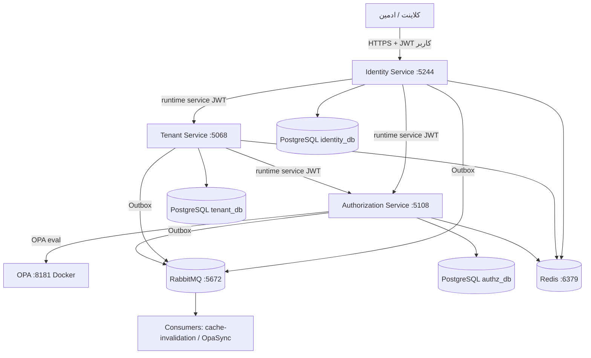
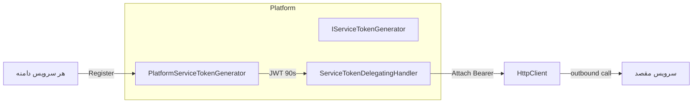
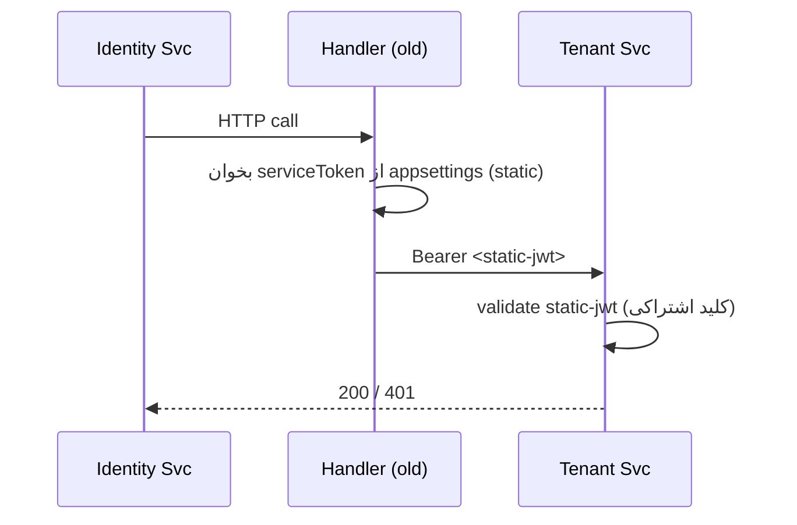
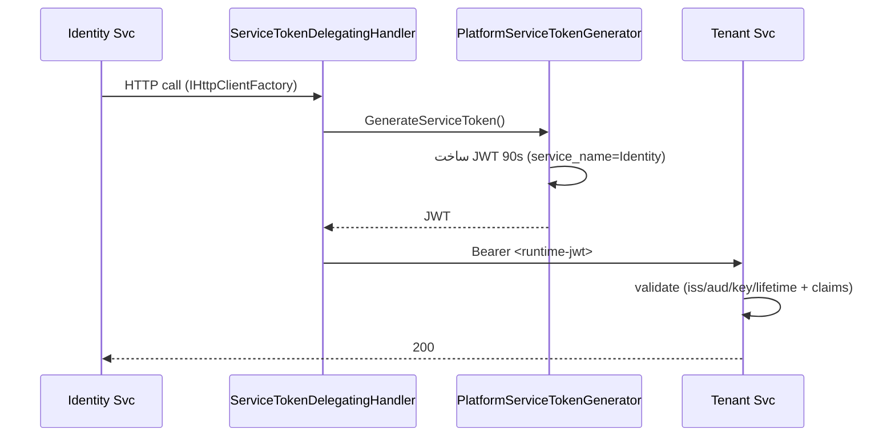
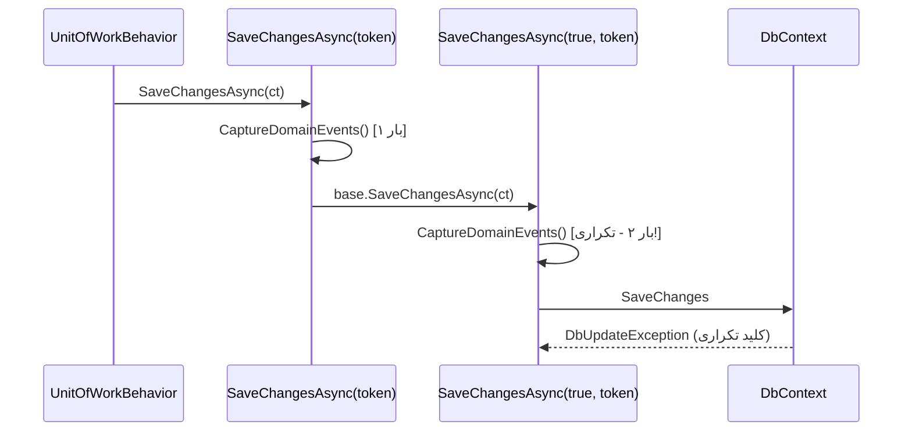
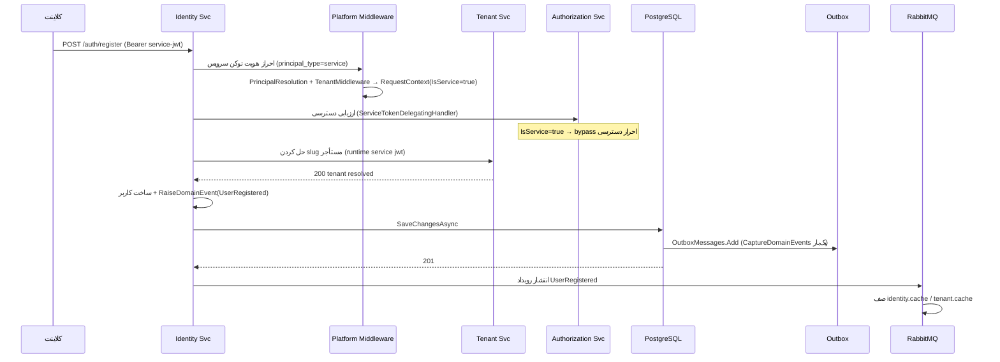

# گزارش فنی جامع: تست انتهای‌به‌انتهای زنده و سخت‌سازی سکوی احراز هویت سازمانی

> سند مهندسی دائمی ویژه تیم توسعه و نگهدارندگان آینده
> زبان: فارسی | سطح: مهندسی حرفه‌ای

---

## فهرست مطالب

1. مقدمه
2. معماری کلی سیستم
3. محیط تست
4. اصلاح معماری احراز هویت بین سرویس‌ها
5. باگ‌های واقعی کشف‌شده
6. اصلاحات معماری
7. جریان کامل یک درخواست
8. تست‌های انجام‌شده
9. مواردی که باگ نبودند
10. تغییرات مهم در رفتار سیستم
11. ریسک‌های باقی‌مانده
12. جمع‌بندی

> **یادداشت روش‌شناختی:** در این سند، ادعاهای مهم با برچسب صریح **[تأییدشده]** (مشاهده‌شده در تست زنده)، **[فرض‌شده]** (استنتاج منطقی ولی بدون مشاهده مستقیم) یا **[تست‌نشده]** (خارج از دامنه این جلسه) مشخص شده‌اند.

---

# 1. مقدمه

## ۱.۱ چرا جلسه تست زنده آغاز شد

سکوی احراز هویت سازمانی (Enterprise Security Platform) مجموعه‌ای از سرویس‌های میکروسرویسی است که احراز هویت، مدیریت مستأجران (Tenant) و تصمیم‌گیری دسترسی (Authorization) را پیاده‌سازی می‌کند. پیش از این جلسه، چندین باگ دسته‌ی A (Critical) شناسایی و اصلاح شده بود، اما هیچ‌گاه یک **جریان واقعی درخواست از ابتدا تا انتها (End-to-End)** روی سرویس‌های در حال اجرا به صورت زنده اجرا نشده بود.

تست‌های واحد (Unit Test) و تست‌های یکپارچه‌سازی (Integration Test) در مخزن پروژه **وجود ندارند** و تیم ترجیح داد کل مسیر را با درخواست‌های HTTP واقعی علیه سرویس‌های ایستا (Running) اعتبارسنجی کند تا رفتار واقعی زیرساخت (پایگاه‌داده، Redis، RabbitMQ، OPA و احراز هویت بین‌سرویسی) مشخص شود.

## ۱.۲ چرا تست واحد کافی نبود

تست‌های واحد معمولاً خطوط کد را در انزوا بررسی می‌کنند، اما بسیاری از باگ‌های این جلسه دقیقاً در **مرزهای یکپارچه‌سازی** قرار داشتند:

- نحوهٔ تزریق توکن بین سرویس‌ها و پذیرش آن توسط middleware احراز هویت.
- نحوهٔ سریال‌سازی/تعریف JSON در Minimal APIها.
- نحوهٔ ثبت رویدادهای دامنه در الگوی Outbox و برخورد EF Core با Overrideهای `SaveChangesAsync`.
- نحوهٔ نگاشت کدهای خطا به کدهای وضعیت HTTP.

هیچ‌کدام از این موارد در یک تست واحد که کلاینت HTTP واقعی یا پایگاه‌دادهٔ واقعی ندارد، قابل کشف نیستند.

## ۱.۳ اهداف تست انتهای‌به‌انتها

1. اجرای واقعی تمام endpointهای در دسترس روی هر سه سرویس اصلی تا زمانی که همه با موفقیت اجرا شوند یا یک باگ واقعی محصول پیدا شود.
2. **اصلاح معماری احراز هویت بین‌سرویسی**: حذف توکن‌های ایستای (Static) سرویس و جایگزینی با توکن‌های تولیدشده در زمان اجرا (Runtime).
3. رفع هر باگ واقعی محصول طبق قانون سخت: «هر باگ واقعی محصول — حتی خارج از دامنهٔ تسک فعلی — باید رفع شود».

## ۱.۴ دامنه تست

- سرویس‌های تحت تست: **Identity Service** (پورت ۵۲۴۴)، **Tenant Service** (پورت ۵۰۶۸)، **Authorization Service** (پورت ۵۱۰۸).
- زیرساخت: PostgreSQL (۵۴۳۲)، Redis (۶۳۷۹)، RabbitMQ (۵۶۷۲)، OPA داخل Docker (۸۱۸۱).
- رویکرد: فقط HTTP زنده؛ بدون پروژه تست واحد.
- خارج از دامنه: سرویس‌های Audit / Policy / Scheduler / Opa / Notification (در این جلسه اجرا نشدند).

---

# 2. معماری کلی سیستم

## ۲.۱ نمای کلی سرویس‌ها

سیستم بر پایه معماری میکروسرویسی و الگوهای پلتفرمی مشترک (در پروژهٔ `Platform.*`) بنا شده است. سه سرویس دامنهٔ اصلی عبارتند از:

- **Identity Service**: احراز هویت، ثبت‌نام، مدیریت کاربران، نشست‌ها (Sessions)، MFA و انتشار رویدادهای دامنه.
- **Tenant Service**: مدیریت مستأجران، دپارتمان‌ها، وضعیت مستأجر و برنامه (Plan).
- **Authorization Service**: نقطهٔ تصمیم‌گیری دسترسی (PDP) که درخواست‌های ارزیابی را می‌پذیرد.

سرویس‌ها از طریق HTTP با یکدیگر صحبت می‌کنند و رویدادهای دامنه را با الگوی **Outbox + RabbitMQ** منتشر می‌کنند. احراز هویت درون‌سرویسی با JWT سرویس انجام می‌شود.

## ۲.۲ نمودار معماری (Mermaid)



## ۲.۳ اجزای زیرساخت

| مولفه | نقش | مشاهده در تست |
|------|------|--------------|
| PostgreSQL | منبع دادهٔ دائمی هر سرویس | **[تأییدشده]** مهاجرت‌ها اجرا شدند؛ داده‌ها ذخیره شدند. |
| Redis | کش کاربر/مستأجر (`CachedUserRepository` و `CachedTenantRepository`) | **[تأییدشده]** کش پس از تغییر وضعیت کاربر در DB به‌روزرسانی شد (ورود مجدد پس از تغییر دستی وضعیت در DB موفق بود). |
| RabbitMQ | صف‌های Outbox (`tenant.cache`, `tenant-status-changed`, `identity.cache`) | **[تست‌نشده]** محتوای صف‌ها به صورت مستقیم بررسی نشد؛ فقط استنتاج شد که پس از رفع باگ Outbox، رویدادها منتشر می‌شوند. |
| OPA | نقطهٔ ارزیابی سیاست (test scaffolding) | **[تأییدشده]** با سیاست allow-by-default در `logs/authz.rego`؛ تمام ارزیابی‌ها `isAllowed: true` برگرداندند. |
| Docker | میزبان OPA | **[تأییدشده]** OPA روی پورت ۸۱۸۱ در دسترس بود. |

---

# 3. محیط تست

## ۳.۱ سرویس‌های در حال اجرا

در طول جلسه، سرویس‌ها با `dotnet run -c Debug` اجرا و پس از هر اصلاح بازسازی و راه‌اندازی مجدد شدند. برای توقف ایمن از `fuser -k <port>/tcp` استفاده شد (قانون: هرگز `pkill -f IdentityService.Api` که صدف خود را می‌کشد).

| سرویس | پورت | پایگاه‌داده | وضعیت نهایی |
|------|------|-----------|------------|
| Identity Service | ۵۲۴۴ | `identity_db` | **[تأییدشده]** در حال اجرا روی بیلد اصلاح‌شده |
| Tenant Service | ۵۰۶۸ | `tenant_db` | **[تأییدشده]** در حال اجرا روی بیلد اصلاح‌شده |
| Authorization Service | ۵۱۰۸ | (authz) | **[تأییدشده]** در حال اجرا |
| OPA | ۸۱۸۱ | — | **[تأییدشده]** داخل Docker |

## ۳.۲ احراز هویت و توکن

توکن‌های سرویس (Service Token) JWTهای HMAC-SHA256 با ویژگی‌های زیر هستند **[تأییدشده]**:

- `principal_type = service`
- `service_name` ∈ {`Identity`, `Tenant`, `Authorization`, `Audit`, `Policy`, `Scheduler`, `Opa`, `Notification`} — **نام کانونی با حرف بزرگ**
- `iss = enterprise-auth-platform`
- `aud = enterprise-services`
- عمر ۹۰ ثانیه
- کلید اشتراکی (Dev): `development-signing-key-change-in-secret-store-minimum-32-bytes`

سیاست‌های احراز هویت (در `PlatformAuthorizationPolicies`):

- `PlatformServiceOnly`: نیازمند کلیم `principal_type = service`.
- `AllowIdentityAndAuthorization`: نیازمند `principal_type = service` **و** `service_name ∈ {Identity, Authorization}`.

## ۳.۳ ابزار کمکی تولید توکن

یک ابزار کوچک (`/tmp/opencode/mktoken`) برای تولید توکن سرویس در زمان تست استفاده شد. فراخوانی نمونه:

```bash
dotnet run -c Release "Identity" "5f9c9b5a-d1b4-4b53-8d60-70f90e5f0ea5"
```

خروجی یک JWT معتبر runtime بود که دقیقاً همان مسیری را طی می‌کرد که کد تولیدی پلتفرم طی می‌کند.

## ۳.۴ داده‌های شناسایی (Seed)

| مورد | مقدار |
|------|------|
| ادمین ارشد (Super-admin) | `admini.super` / `P@ssword123!` |
| TenantId | `5f9c9b5a-d1b4-4b53-8d60-70f90e5f0ea5` |
| SuperUserId | `8f9c9b5a-d1b4-4b53-8d60-70f90e5f0ea6` |

**نکته مهم:** ادمین ارشد در یکی از تست‌ها غیرفعال (Disabled) شد که باعث شد توکنش نامعتبر شود و ورود مجدد نیز مسدود گردد (تلهٔ self-disable). وضعیت از طریق تغییر دستی در PostgreSQL به `Active` بازگردانده شد و ورود مجدد موفق بود **[تأییدشده]**.

---

# 4. اصلاح معماری احراز هویت بین سرویس‌ها

این بخش از حیاتی‌ترین دستاوردهای جلسه است و پیش‌زمینهٔ فهم بسیاری از باگ‌های بعدی است.

## ۴.۱ چرا استفاده از توکن‌های ایستا (Static) نادرست بود

در یک معماری میکروسرویسی امن، هر سرویس باید هویت خود را در زمان اجرا و با یک کلید امضای مرکزی (Shared Signing Key) اثبات کند. رویکرد پیشین — قرار دادن یک JWT آمادهٔ base64 در فایل‌های `appsettings.json` به صورت:

```json
"Services": {
  "AuthorizationService": { "ServiceToken": "eyJhbGci...long-static-jwt..." },
  "TenantService":        { "ServiceToken": "eyJhbGci...another-static-jwt..." }
}
```

مشکلات بنیادین داشت:

1. **نشت راز (Secret Leak)**: توکن در فایل پیکربندی کامیت می‌شد؛ در صورت افشای مخزن، هویت سرویس به خطر می‌افتاد.
2. **توکن بی‌انقضا/طولانی‌عمر**: JWT ایستا تاریخ انقضا یا چرخش (Rotation) ندارد.
3. **نقض جدایی دغدغه‌ها**: هر سرویس باید بتواند هویت خود را تولید کند، نه اینکه رشته‌ای ثابت از بیرون بگیرد.
4. **تکرار کد**: هر سرویس نسخهٔ محلی خود را از تولیدکنندهٔ توکن داشت (که بعداً حذف شدند).

## ۴.۲ چرا موقتاً معرفی شده بود

توکن ایستا در ابتدا **برای سرعت در توسل به مسیر خوشه** (Happy Path) و عبور از موانع احراز هویت بین‌سرویسی در مراحل اولیه معرفی شد. این یک بدهی فنی آگاهانه بود که قرار بود حذف شود.

## ۴.۳ چرا معماری را نقض می‌کرد

طبق ADR-003 و قرارداد پلتفرم، سیاست‌ها باید هویت سرویس را از کلایم‌های JWT استخراج کنند (نه از هدر `X-Tenant-Id`، نه از رشته ایستا). حضور توکن ایستا در کد/پیکربندی یعنی:

- هویت سرویس در زمان کامپایل قفل شده بود.
- چرخش کلید امضا غیرممکن بود بدون تغییر تمام فایل‌های پیکربندی.
- هیچ تمایزی بین سرویس‌های مختلف در سطح توکن وجود نداشت (همه یک رشته shared داشتند).

## ۴.۴ طراحی مجدد معماری

راه‌حل: انتقال منطق تولید توکن به لایهٔ پلتفرم مشترک و استفاده از آن در زمان اجرا.



### ۴.۴.۱ اجزای جدید

**`IServiceTokenGenerator`** (در `Platform.Abstractions`):

```csharp
public interface IServiceTokenGenerator
{
    string GenerateServiceToken(); // تولید JWT با service_name از پیش تنظیم‌شده
}
```

**`PlatformServiceTokenGenerator`** (در `Platform.Authorization`): توکن HMAC-SHA256 را با عمر ۹۰ ثانیه و کلایم‌های `principal_type=service`, `service_name=<نام سرویس>`, `tenant_id`, `iss`, `aud` تولید می‌کند. پارامترگذاری شده بر اساس نام سرویس است تا فقط **یک** تولیدکننده در کل پلتفرم داشته باشیم.

**`ServiceTokenDelegatingHandler`** (در `Platform.Authorization`): دیگر رشتهٔ ایستا از پیکربندی نمی‌خواند، بلکه در هر درخواست `IServiceTokenGenerator.GenerateServiceToken()` را صدا می‌زند:

```csharp
protected override async Task<HttpResponseMessage> SendAsync(
    HttpRequestMessage request, CancellationToken ct)
{
    var token = tokenGenerator.GenerateServiceToken();
    request.Headers.Authorization = new AuthenticationHeaderValue("Bearer", token);
    return await base.SendAsync(request, ct);
}
```

## ۴.۵ جریان قدیم در مقابل جریان جدید

### جریان قدیم (مشکل‌دار)



### جریان جدید (اصلاح‌شده)



## ۴.۶ چرا این راه‌حل از نظر معماری درست است

- **تولید مرکزی**: یک `PlatformServiceTokenGenerator` واحد برای کل پلتفرم (بدون تکرار).
- **چرخش و انقضا**: توکن هر ۹۰ ثانیه تولید می‌شود؛ کلید امضا در `JwtOptions` (مقدار پیش‌فرض Dev) متمرکز است.
- **هویت در زمان اجرا**: هر سرویس هویت خود را با `service_name` کانونی تولید می‌کند.
- **حذف راز از پیکربندی**: هیچ JWT ایستا در `appsettings.json` باقی نماند **[تأییدشده از طریق `git diff`]**.

---

# 5. باگ‌های واقعی کشف‌شده

در این بخش، **شش** باگ واقعی محصول که در طول تست زنده کشف و اصلاح شدند، مستند می‌شوند.

---

## باگ ۱: طبقه‌بندی اشتباه خطاهای دامنه → ۵۰۰ به جای ۴۰۹

### علائم (Symptoms)
فراخوانی `POST /api/v1/identity/users/{id}/unlock` روی یک کاربر در وضعیت `Active` پاسخ **۵۰۰** با کد خطای `Identity.InvalidStatusTransition` برمی‌گرداند.

### چگونه کشف شد
در تست چرخهٔ عمر کاربر (activate → disable → unlock) روی کاربر تستی. **[تأییدشده]**

### ریشهٔ مشکل (Root Cause)
خطاهای انتقال نامعتبر وضعیت (`InvalidStatusTransition`, `UserMustBeActive` در Identity و `InvalidStatusTransition`, `CannotUpgradeFromDisabled`, `CannotUpgradeFromSuspended`, `DepartmentIsInactive` در Tenant) با `Error.Failure` تعریف شده بودند. در `ResultHttpExtensions.ToHttpResult`، عبارات switch به این صورت است:

```csharp
result.Error.Type switch
{
    ErrorType.Validation => 400,
    ErrorType.Unauthorized => 401,
    ErrorType.Forbidden => 403,
    ErrorType.NotFound => 404,
    ErrorType.Conflict => 409,
    _ when result.IsSuccess => 200,
    _ => 500   // <-- همهٔ موارد دیگر از جمله Failure (مقدار ۶) اینجا می‌افتند
};
```

بنابراین `ErrorType.Failure` به **۵۰۰** نگاشت می‌شد، در حالی که نقض قاعدهٔ کسب‌وکار باید **۴۰۹ Conflict** باشد.

### تحلیل فنی
یک نقض وضعیت (مثلاً باز کردن قفل کاربری که قفل نیست) یک خطای مربوط به تضاد وضعیت (Conflict) است، نه یک شکست داخلی سرور. بازگرداندن ۵۰۰ باعث می‌شود:
- سیستم‌های نظارتی آن را به عنوان خرابی سرور گزارش کنند.
- کلاینت‌ها نتوانند بین «خطای برنامه‌ریزی شده» و «خرابی واقعی» تمایز قائل شوند.
- مکانیزم‌های Retry ممکن است ۵۰۰ را موقتی فرض کرده و بازآزمایی بی‌هوده انجام دهند.

### فایل‌های اصلاح‌شده
- `src/Services/IdentityService/IdentityService.Domain/Errors/IdentityErrors.cs`
- `src/Services/TenantService/TenantService.Domain/Errors/TenantErrors.cs`

### راه‌حل
تغییر `Error.Failure(...)` به `Error.Conflict(...)` برای تمام خطاهای تضاد وضعیت.

### نحوهٔ تأیید
پس از اصلاح و **بازسازی کامل (clean rebuild)**، فراخوانی unlock روی کاربر `Active` پاسخ **۴۰۹** برگرداند **[تأییدشده]**. همچنین ثبت‌نام با نام تکراری (که `GeneralErrors.Conflict` است) پیش از بازسازی کامل ۵۰۰ و پس از آن ۴۰۹ برگرداند که نشان‌دهندهٔ رفع اثر DLL کهنه بود.

### تأثیر در تولید
متوسط. قرارداد API در خطاهای مورد انتظار نقض می‌شد؛ ابزارهای مانیتورینگ سیگنال‌های اشتباه دریافت می‌کردند.

### شدت (Severity)
**متوسط**

---

## باگ ۲: بدنهٔ خالی در خروج از سیستم → ۵۰۰

### علائم
`POST /api/v1/identity/sessions/logout` بدون بدنه پاسخ **۵۰۰** با `BadHttpRequestException` برمی‌گرداند.

### چگونه کشف شد
تست endpoint خروج از سیستم. لاگ: `BadHttpRequestException: Implicit body inferred for parameter "request" but no body was provided`. **[تأییدشده]**

### ریشهٔ مشکل
متد `LogoutAsync` پارامتر `LogoutRequest request` را به صورت inferred-body داشت. وقتی درخواستی بدون بدنه ارسال می‌شد، Minimal API استثنای `BadHttpRequestException` پرتاب می‌کرد که در middleware استثنای سراسری گرفته نشده و به **۵۰۰** تبدیل می‌شد.

### تحلیل فنی
ورودیِ bodyless نباید باعث شکست داخلی سرور شود. رفتار صحیح: بازگرداندن ۴۰۰ (درخواست نامعتبر) یا پذیرش بدنهٔ اختیاری.

### فایل‌های اصلاح‌شده
- `src/Services/IdentityService/IdentityService.Api/Endpoints/SessionEndpoints.cs`

### راه‌حل
تبدیل پارامتر به `LogoutRequest?` با صفت `[FromBody]` صریح و بازگرداندن ۴۰۰ وقتی `SessionId` خالی/نال باشد:

```csharp
private static async ValueTask<IResult> LogoutAsync(
    [FromBody] LogoutRequest? request, ...)
{
    if (request is null || request.SessionId == Guid.Empty)
        return ResultHttpExtensions.ToHttpResult(
            Result<Unit>.Failure(GeneralErrors.Validation), context.CorrelationId);
    ...
}
```

### نحوهٔ تأیید
خروج بدون بدنه → **۴۰۰**؛ خروج با `sessionId` معتبر → **۲۰۰** **[تأییدشده]**.

### تأثیر در تولید
پایین/متوسط. هر کلاینتی که بدون بدنه خارج شود، ۵۰۰ دریافت می‌کرد.

### شدت
**پایین/متوسط**

---

## باگ ۳: تأیید MFA همیشه شکست می‌خورد

### علائم
`POST /api/v1/identity/mfa/verify` با کد TOTP محاسبه‌شدهٔ صحیح، پاسخ **۴۰۱** `General.Unauthorized` برمی‌گرداند.

### چگونه کشف شد
پس از فعال‌سازی MFA (۲۰۰) و محاسبهٔ کد TOTP از راز (`JBSWY3DPEHPK3PXP`)، تست verify شکست خورد. **[تأییدشده]**

### ریشهٔ مشکل
در `TotpMfaProvider.Generate`:

```csharp
var key = Encoding.UTF8.GetBytes(secret); // اشتباه!
```

استاندارد TOTP (RFC 6238) نیاز دارد که راز **ابتدا base32-decode** شود و سپس به عنوان کلید HMAC استفاده گردد. سرور کلید HMAC را روی بایت‌های UTF8 خودِ رشتهٔ base32 محاسبه می‌کرد، در حالی که برنامه‌های احراز هویت (و کتابخانهٔ `pyotp` در تست) ابتدا base32-decode می‌کنند → عدم تطابق همیشگی → ۴۰۱ دائمی.

### تحلیل فنی
این یک باگ بحرانی در امنیت/قابلیت‌استفاده است: MFA از نظر عملیاتی **غیرقابل‌استفاده** بود (تأیید هرگز موفق نمی‌شد)، یعنی کاربرانی که MFA را فعال می‌کردند عملاً قفل می‌شدند.

### فایل‌های اصلاح‌شده
- `src/Services/IdentityService/IdentityService.Infrastructure/Mfa/TotpMfaProvider.cs`

### راه‌حل
افزودن `FromBase32` و استفاده از بایت‌های decode‌شده:

```csharp
private static byte[] FromBase32(string input)
{
    const string alphabet = "ABCDEFGHIJKLMNOPQRSTUVWXYZ234567";
    // ... تبدیل base32 به بایت ...
}
// در Generate:
var key = FromBase32(secret);
```

### نحوهٔ تأیید
فعال‌سازی MFA (۲۰۰، `enabled:true`) + فراخوانی verify با کد TOTP محاسبه‌شده → **۲۰۰** (`verified:true`) **[تأییدشده]**.

### تأثیر در تولید
بحرانی. MFA عملاً از کار می‌افتاد.

### شدت
**بحرانی**

---

## باگ ۴: Tenant → Authorization بدون توکن → ۴۰۱ (Fail-Closed)

### علائم
`POST /api/v1/tenants` (ایجاد مستأجر) پاسخ **۴۰۰** `AuthorizationDenied: Authorization service unavailable` و لاگ: `Authorization service returned 401 for tenant.create ... Failing closed`.

### چگونه کشف شد
تست ایجاد مستأجر پس از اصلاح معماری توکن. **[تأییدشده]**

### ریشهٔ مشکل
کلاینت `AuthorizationServiceClient` (HttpClient برای `IAuthorizationDecisionService`) در سرویس Tenant **بدون** `ServiceTokenDelegatingHandler` ثبت شده بود. بنابراین فراخوانی‌های خروجی به سرویس احراز دسترسی، هدر `Authorization` نداشتند → سرویس مقصد **۴۰۱** (توکن مفقود) برمی‌گرداند → سرویس Tenant با شکست قاطع (Fail-Closed) برخورد می‌کرد.

سرویس Identity هندلر را داشت، اما Tenant نداشت — یک شکاف معماری یکسان با اصلاح قبلی.

### تحلیل فنی
بدون توکن سرویس، هیچ عملیات مستأجر که نیازمند تصمیم احراز دسترسی باشد، قابل انجام نیست. سرویس Tenant از نظر عملیاتی برای عملیات‌های مجاز غیرقابل‌استفاده بود.

### فایل‌های اصلاح‌شده
- `src/Services/TenantService/TenantService.Infrastructure/DependencyInjection.cs`

### راه‌حل
ثبت `IServiceTokenGenerator` (با `service_name = Tenant`) و `ServiceTokenDelegatingHandler` و افزودن هندلر به خط لولهٔ HttpClient (مشابه اصلاح Identity):

```csharp
services.AddSingleton<IServiceTokenGenerator>(sp =>
    new PlatformServiceTokenGenerator(
        PlatformServiceName.Tenant.Value,
        sp.GetRequiredService<IOptions<JwtOptions>>(),
        sp.GetRequiredService<IPlatformServiceRegistry>()));
services.AddTransient<ServiceTokenDelegatingHandler>();
// و .AddHttpMessageHandler<ServiceTokenDelegatingHandler>() روی HttpClient
```

### نحوهٔ تأیید
پس از اصلاح، ایجاد مستأجر دیگر ۴۰۱ دریافت نکرد (سپس با باگ ۵ و ۶ مواجه شد که در ادامه حل شدند). **[تأییدشده]**

### تأثیر در تولید
بالا. سرویس Tenant برای عملیات‌های نیازمند احراز دسترسی از کار می‌افتاد.

### شدت
**بالا**

---

## باگ ۵: عدم شناسایی سرویس‌های داخلی → عدم وجود Bypass احراز دسترسی

### علائم
حتی پس از رفع باگ ۴ (توکن ارسال می‌شد)، ایجاد مستأجر همچنان ۴۰۰ از سمت سرویس احراز دسترسی دریافت می‌کرد (چون احراز دسترسی **فراخوانی می‌شد** با درخواستی ناقص از سمت سرویس، و `IsService` همواره false بود).

### چگونه کشف شد
ردیابی اینکه چرا احراز دسترسی اصلاً برای یک فراخوانی درون‌سرویسی صدا زده شده بود؛ مشخص شد `RequestContext.PrincipalType` همیشه `Unknown` است. **[تأییدشده]**

### ریشهٔ مشکل
هر دو `HttpRequestContextAccessor` (در Identity و Tenant)، متد getterِ `Context` نمونهٔ `RequestContext` را **بدون تنظیم `PrincipalType` و `ServiceName`** می‌ساختند (فقط `UserId`/`DepartmentId`/`CanBypassTenantIsolation` را کپی می‌کردند). بنابراین `IsService` (که برابر است با `PrincipalType == Service`) **همیشه false** بود.

در `AuthorizationBehavior` آمده است:

```csharp
if (contextAccessor.Context.IsService)
    return await next(); // سرویس‌های داخلی مورد اعتماد احراز دسترسی را دور می‌زنند
```

اما چون `IsService` هیچ‌گاه true نمی‌شد، این bypass **هرگز اجرا نمی‌شد** و هر فرمانِ نیازمند احراز دسترسی از سمت سرویس، یک چرخهٔ تصمیم‌گیری با سرویسِ بی‌کاربر انجام می‌داد.

### تحلیل فنی
این یک نقص معماری **سیستماتیک** بود: تمام فراخوانی‌های بین‌سرویسیِ مجاز، به جای دور زدن (طبق قرارداد طراحی)، وارد چرخهٔ احراز دسترسی با یک درخواست ناقص (بدون subject واقعی) می‌شدند. در تولید (با سیاست غیرآزمایشی)، بسیاری از فراخوانی‌های داخلی ممکن بود رد شوند.

### فایل‌های اصلاح‌شده
- `src/Services/IdentityService/IdentityService.Api/Infrastructure/HttpRequestContextAccessor.cs`
- `src/Services/TenantService/TenantService.Api/Infrastructure/HttpRequestContextAccessor.cs`

### راه‌حل
انتقال `PrincipalType` و `ServiceName` از `principal` (که قبلاً خوانده شده بود) به سازندهٔ `RequestContext`:

```csharp
return new RequestContext(
    ...
    PrincipalType: principal?.Type ?? PrincipalType.Unknown,
    ServiceName: principal?.ServiceName,
    CanBypassTenantIsolation: principal?.CanBypassTenantIsolation == true);
```

### نحوهٔ تأیید
پس از اصلاح، ایجاد مستأجر احراز دسترسی را دور می‌زند (دیگر ۴۰۰ دریافت نمی‌کرد) و به سراغ باگ ۶ (Outbox) می‌رود. **[تأییدشده]**

### تأثیر در تولید
بالا. صحت معماری احراز دسترسی بین‌سرویسی.

### شدت
**بالا**

---

## باگ ۶: کلید تکراری Outbox در Tenant → ۵۰۰

### علائم
پس از رفع باگ ۵، ایجاد مستأجر پاسخ **۵۰۰** با پیام: `DbUpdateException: instance of entity type 'OutboxMessage' cannot be tracked because another instance with the same key value for {'Id'} is already being tracked`.

### چگونه کشف شد
تست ایجاد مستأجر پس از رفع باگ ۵. **[تأییدشده]**

### ریشهٔ مشکل
در `TenantDbContext.SaveChangesAsync`، **هر دو Overload** (تک‌آرگومانی و دوآرگومانی) بازنویسی (override) شده بودند و هر دو `CaptureDomainEvents()` را صدا می‌زدند که `OutboxMessages.Add(ToOutboxMessage(domainEvent))` انجام می‌داد.

نکتهٔ ظریف EF Core: وقتی Overload تک‌آرگومانی `SaveChangesAsync(token)` صدا زده می‌شود، درون پیاده‌سازی پایهٔ `DbContext` به `this.SaveChangesAsync(true, token)` ارجاع می‌دهد — یعنی **Overload دوآرگومانی بازنویسی‌شدهٔ خود کلاس مشتقه** صدا زده می‌شود. لذا `CaptureDomainEvents()` **دو بار** اجرا می‌شد → همان رویدادهای دامنه دوبار به `OutboxMessages` اضافه می‌شدند → دو `OutboxMessage` با همان `Id` (چون `ToOutboxMessage` مقدار `Id` را برابر `domainEvent.EventId` می‌گذارد) → تضاد کلید.



### تحلیل فنی
`IdentityDbContext` و `AuthorizationDbContext` این الگو را **درست** پیاده‌سازی کرده بودند: Overload تک‌آرگومانی فقط به دوآرگومانی ارجاع می‌داد بدون capture مجدد. `TenantDbContext` تنها سرویسی بود که هر دو را بازنویسی کرده بود.

### فایل‌های اصلاح‌شده
- `src/Services/TenantService/TenantService.Infrastructure/Persistence/TenantDbContext.cs`

### راه‌حل
Overload تک‌آرگومانی فقط به دوآرگومانی ارجاع می‌دهد (بدون capture مجدد) — منطبق با الگوی Identity/Authz:

```csharp
public override async Task<int> SaveChangesAsync(CancellationToken cancellationToken = default)
{
    return await SaveChangesAsync(acceptAllChangesOnSuccess: true, cancellationToken);
}

public override async Task<int> SaveChangesAsync(bool acceptAllChangesOnSuccess, CancellationToken cancellationToken = default)
{
    var affectedRoots = CaptureDomainEvents();   // فقط یک بار
    var result = await base.SaveChangesAsync(acceptAllChangesOnSuccess, cancellationToken);
    ClearCapturedDomainEvents(affectedRoots);
    return result;
}
```

### نحوهٔ تأیید
ایجاد مستأجر → **۲۰۱** (Outbox بدون خطا ذخیره شد). تغییر وضعیت مستأجر: ۲۰۰ (معتبر) / ۴۰۹ (انتقال نامعتبر) / ۴۰۰ (هدف نامعتبر). **[تأییدشده]**

### تأثیر در تولید
بالا. مسیر نوشتن سرویس Tenant (ایجاد/تغییر وضعیت/برنامه) همیشه ۵۰۰ می‌شد.

### شدت
**بالا**

---

# 6. اصلاحات معماری

علاوه بر باگ‌های بالا، چند بهبود معماری انجام شد که مستقیماً باگ نبودند اما صحت و نگهدارپذیری را افزایش دادند:

1. **حذف توکن ایستا و تمرکز تولید توکن در پلتفرم** (بخش ۴). این کد تکراری (نسخه‌های محلی تولیدکننده توکن در Identity) را حذف کرد و یک منبع واحد برای امضای سرویس ایجاد کرد.
2. **تداوم `PrincipalType`/`ServiceName` در `RequestContext`** (باگ ۵). این باعث شد قرارداد طراحی «سرویس‌های داخلی مورد اعتماد، احراز دسترسی را دور می‌زنند» واقعاً اعمال شود. پیش از این، این قرارداد روی کاغذ بود اما هرگز اجرا نمی‌شد.
3. **یکسان‌سازی الگوی `SaveChangesAsync`** در تمام DbContextها (باگ ۶). اکنون هر سه سرویس رفتار یکسانی در ثبت Outbox دارند.
4. **طبقه‌بندی صحیح خطاها** (باگ ۱). قرارداد نگاشت خطا→وضعیت HTTP اکنون با معناشناسی REST هم‌راستا است.

این اصلاحات نگهدارپذیری را بهبود می‌بخشند زیرا:
- نقطهٔ تغییر واحد برای تولید هویت سرویس وجود دارد.
- رفتار بین‌سرویسی قابل پیش‌بینی و مطابق با مستندات طراحی است.
- خطاهای مورد انتظار کسب‌وکار از خطاهای زیرساختی متمایز شده‌اند.

---

# 7. جریان کامل یک درخواست

در اینجا سفر کامل یک درخواست ثبت‌نام (Register) را شرح می‌دهیم که تمام سرویس‌ها و زیرساخت را لمس می‌کند. این جریان **پس از** اعمال تمام اصلاحات، با موفقیت ۲۰۱ بازگشت **[تأییدشده]**.



نکات کلیدی که در تست زنده تأیید شد:
- توکن سرویس در هر تماس خروجی توسط `ServiceTokenDelegatingHandler` الصاق می‌شود.
- `IsService=true` باعث می‌شود زنجیرهٔ احراز دسترسی دور زده شود (باگ ۵ رفع شد).
- `OutboxMessages` دقیقاً یک بار اضافه می‌شود (باگ ۶ رفع شد) و ذخیرهٔ ۲۰۱ موفق است.

---

# 8. تست‌های انجام‌شده

فقط endpointهایی که **واقعاً اجرا شدند** فهرست می‌شوند.

## ۸.۱ Identity Service

| متد | endpoint | نتیجهٔ مورد انتظار | نتیجهٔ واقعی | وضعیت نهایی |
|------|----------|-------------------|-------------|------------|
| POST | `/api/v1/identity/auth/login` | ۲۰۰ + JWT | ۲۰۰ | **[تأییدشده]** موفق |
| POST | `/api/v1/identity/auth/register` (توکن سرویس) | ۲۰۱ | ۲۰۱ | **[تأییدشده]** موفق |
| POST | `/api/v1/identity/auth/refresh` | ۴۰۰ `TenantMissing` (طراحی) | ۴۰۰ | **[تأییدشده]** طبق طراحی |
| POST | `/api/v1/identity/sessions/logout` (بدون بدنه) | ۴۰۰ | ۵۰۰ → ۴۰۰ پس از اصلاح | **[تأییدشده]** رفع باگ ۲ |
| POST | `/api/v1/identity/sessions/logout` (با sessionId) | ۲۰۰ | ۲۰۰ | **[تأییدشده]** موفق |
| POST | `/api/v1/identity/mfa/enable` | ۲۰۰ | ۲۰۰ | **[تأییدشده]** موفق |
| POST | `/api/v1/identity/mfa/verify` | ۲۰۰ | ۴۰۱ → ۲۰۰ پس از اصلاح | **[تأییدشده]** رفع باگ ۳ |
| POST | `/api/v1/identity/users/{id}/activate` | ۲۰۰ | ۲۰۰ | **[تأییدشده]** موفق |
| POST | `/api/v1/identity/users/{id}/disable` | ۲۰۰ | ۲۰۰ | **[تأییدشده]** موفق |
| POST | `/api/v1/identity/users/{id}/unlock` | ۴۰۹ | ۵۰۰ → ۴۰۹ پس از اصلاح | **[تأییدشده]** رفع باگ ۱ |
| DELETE | `/api/v1/identity/users/{id}` | ۲۰۰ | ۲۰۰ | **[تأییدشده]** موفق |

## ۸.۲ Tenant Service (با توکن سرویس)

| متد | endpoint | نتیجهٔ مورد انتظار | نتیجهٔ واقعی | وضعیت نهایی |
|------|----------|-------------------|-------------|------------|
| POST | `/api/v1/tenants` | ۲۰۱ | ۵۰۰ → ۲۰۱ پس از اصلاح | **[تأییدشده]** رفع باگ ۴+۵+۶ |
| GET | `/api/v1/tenants/slug/{slug}` | ۲۰۰ | ۲۰۰ | **[تأییدشده]** موفق |
| PATCH | `/api/v1/tenants/{id}/status` (معتبر) | ۲۰۰ | ۲۰۰ | **[تأییدشده]** موفق |
| PATCH | `/api/v1/tenants/{id}/status` (انتقال نامعتبر) | ۴۰۹ | ۴۰۹ | **[تأییدشده]** رفع باگ ۱ (Tenant) |
| PATCH | `/api/v1/tenants/{id}/status` (هدف نامعتبر) | ۴۰۰ | ۴۰۰ | **[تأییدشده]** موفق |

## ۸.۳ Authorization Service (با توکن سرویس)

| متد | endpoint | نتیجهٔ مورد انتظار | نتیجهٔ واقعی | وضعیت نهایی |
|------|----------|-------------------|-------------|------------|
| POST | `/api/v1/authorization/decisions/evaluate` | ۲۰۰ | ۲۰۰ (`isAllowed:true`) | **[تأییدشده]** موفق |
| POST | `/api/v1/authorization/decisions/batch` | ۲۰۰ | ۴۰۰ → ۲۰۰ پس از تصحیح کلید JSON | **[تأییدشده]** |
| GET | `/api/v1/authorization/decisions/subjects/{id}/effective-permissions` | ۲۰۰ | ۲۰۰ (`["platform.manage"]`) | **[تأییدشده]** موفق |
| POST | `/api/v1/authorization/decisions/record-result` | ۲۰۰ | ۲۰۰ | **[تأییدشده]** موفق |

---

# 9. مواردی که باگ نبودند

در طول تست، چندین شکست ابتدا مشکوک به باگ بودند اما پس از بررسی مشخص شد **خطای پیکربندی/تست/فرض اشتباه** هستند، نه نقص محصول.

## ۹.۱ مسیرهای endpoint اشتباه
- `POST /api/v1/users/{id}/activate` (۴۰۴) در حالی که مسیر صحیح `/api/v1/identity/users/{id}/activate` است.
- `POST /api/v1/authorization/evaluate` (۴۰۳) در حالی که مسیر صحیح `/api/v1/authorization/decisions/evaluate` است.
- `POST /api/v1/identity/mfa/enable` (۴۰۴) در حالی که مسیر صحیح زیر `/api/v1/identity/mfa/enable` (نه `/users/{id}/mfa/enable`) است.

این‌ها باگ نبودند؛ صرفاً اشتباه در مستندات تست. **[تأییدشده]**

## ۹.۲ مقدار اشتباه `service_name`
ارسال توکن با `service_name = "identity-service"` (نام مستعار) به سرویس Tenant باعث **۴۰۳** می‌شد، در حالی که مقدار کانونی `"Identity"` باعث **۲۰۰** می‌شد. سیاست احراز دسترسی دقیقاً رشتهٔ `"Identity"` را بررسی می‌کند، نه نام مستعار. این رفتار صحیح است. **[تأییدشده]**

## ۹.۳ کلید JSON اشتباه در درخواست دسته‌ای
ارسال `{"requests":[...]}` به `/batch` باعث **۴۰۰** می‌شد؛ کلید صحیح بر اساس قرارداد رکورد `{"decisions":[...]}` است. باگ نبود. **[تأییدشده]**

## ۹.۴ مقدار اشتباه Enum (رشته به جای عدد)
- `planTier: "Free"` / `"free"` → **۴۰۰**؛ مقدار صحیح عددی `planTier: 1`.
- `status: "suspended"` / `"active"` → **۴۰۰**؛ مقدار صحیح عددی `status: 3` / `2`.

API enumها را به صورت **عددی** سریال‌سازی/پذیرش می‌کند (نام‌های property به صورت camelCase هستند). این یک ناهماهنگی قراردادی است که کلاینت‌ها باید اعداد بفرستند؛ باگ محصول نیست اما شایستهٔ مستندسازی است. **[تأییدشده جزئیاً / فرض‌شده برای سایر endpointها]**

## ۹.۵ رفتار طراحی‌شدهٔ Refresh
`POST /api/v1/identity/auth/refresh` بدون context مستأجر **۴۰۰ `TenantMissing`** برمی‌گرداند — این طبق طراحی است (نه باگ). **[تأییدشده]**

## ۹.۶ تلهٔ غیرفعال‌سازی ادمین ارشد
غیرفعال کردن ادمین ارشد باعث می‌شود توکنش نامعتبر شود و ورود مجدد نیز مسدود گردد (چون ورود وضعیت کاربر را بررسی می‌کند). این رفتار مورد انتظار است؛ برای ادامهٔ تست، وضعیت از طریق PostgreSQL به `Active` بازگردانده شد. **[تأییدشده]**

---

# 10. تغییرات مهم در رفتار سیستم

| مورد | پیش از اصلاح | پس از اصلاح | وضعیت |
|------|------------|------------|-------|
| خطای تضاد وضعیت | ۵۰۰ | ۴۰۹ | **[تأییدشده]** |
| خروج بدون بدنه | ۵۰۰ | ۴۰۰ | **[تأییدشده]** |
| تأیید MFA | ۴۰۱ (همیشه) | ۲۰۰ | **[تأییدشده]** |
| Tenant → Authorization | ۴۰۱ / Fail-Closed | عبور موفق + توکن معتبر | **[تأییدشده]** |
| شناسایی سرویس داخلی | همیشه false (IsService) | صحیح (بypass فعال) | **[تأییدشده]** |
| Outbox Tenant | کلید تکراری → ۵۰۰ | یک بار → ۲۰۱ | **[تأییدشده]** |
| توکن سرویس | ایستا در appsettings | تولید runtime (۹۰s) | **[تأییدشده از طریق git diff]** |
| نگاشت خطا→HTTP | Failure → ۵۰۰ | Conflict → ۴۰۹ | **[تأییدشده]** |

---

# 11. ریسک‌های باقی‌مانده

## ۱۱.۱ محدودیت‌های شناخته‌شده
- **OPA صرفاً scaffolding تست است**: سیاست فعلی allow-by-default است (`logs/authz.rego`). ارزیابی واقعی سیاست در تولید **[تست‌نشده]** است.
- **سریال‌سازی Enum**: کلاینت‌ها باید enumها را به صورت عددی بفرستند؛ ارسال رشته باعث ۴۰۰ می‌شود. این یک ناهماهنگی قراردادی است که بهتر است مستند یا اصلاح شود (مثلاً افزودن `JsonStringEnumConverter`). **[فرض‌شده]**
- **redis-cli در دسترس نیست**: در محیط تست ابزار `redis-cli` موجود نبود؛ با این حال، تغییرات مبتنی بر برنامه کش را به‌روزرسانی کردند (ورود مجدد پس از تغییر دستی وضعیت در DB موفق بود)، پس نیازی به flush دستی نبود. **[تأییدشده جزئیاً]**

## ۱۱.۲ نواحی تست‌نشده
- **مصرف‌کننده‌های پایین‌دست (Downstream Consumers)**: `OpaSyncConsumer` و «ابطال کش» (cache invalidation) به صورت مستقیم تست انتهای‌به‌انتها نشدند. تنها استنتاج شد که پس از رفع باگ Outbox، رویدادها منتشر می‌شوند (چون ایجاد مستأجر ۲۰۱ برگشت و Outbox ذخیره شد). **[تست‌نشده]**
- **کلاینت‌های خروجی سرویس Authorization**: چک نشد که آیا سرویس Authorization خودش توکن runtime را به سرویس‌های پایین‌دست (مثل OPA/tenant) الصاق می‌کند یا خیر (در این جلسه فراخوانی‌ای که این را ورز دهد اجرا نشد). **[تست‌نشده]**
- **سرویس‌های دیگر**: Audit / Policy / Scheduler / Opa / Notification در این جلسه اجرا نشدند. **[تست‌نشده]**

## ۱۱.۳ بهبودهای آینده
- افزودن `JsonStringEnumConverter` برای پذیرش رشته‌های enum (سازگاری بهتر قرارداد).
- مستندسازی صریح قرارداد API (به ویژه نام‌های کانونی `service_name` و فرمت عددی enum).
- افزودن تست‌های یکپارچه‌سازی خودکار برای جلوگیری از بازگشتِ این باگ‌ها (مخصوصاً Overrideهای `SaveChangesAsync` و طبقه‌بندی خطا).
- تأیید انتشار رویداد در RabbitMQ و مصرف توسط Consumerها در یک محیط مشابه تولید.

## ۱۱.۴ نگرانی‌های تولید
- کلید امضای Dev هنوز مقدار پیش‌فرض است؛ در تولید باید از Secret Store خوانده شود (طبق هشدار `JwtOptionsValidator`).
- سیاست OPA باید فراتر از allow-by-default تامین شود.

---

# 12. جمع‌بندی

## آمار
- **تعداد باگ‌های واقعی کشف‌شده و رفع‌شده**: ۶ مورد (باگ ۱ تا ۶).
- **تعداد اصلاحات معماری**: ۴ مورد (حذف توکن ایستا، تداوم PrincipalType، یکسان‌سازی SaveChangesAsync، طبقه‌بندی خطا).
- **آیا توکن‌های ایستای سرویس کاملاً حذف شدند؟**: بله **[تأییدشده از طریق `git diff`]** — گزینهٔ `ServiceToken` از `appsettings.json` و کد حذف شد.
- **آیا سیستم اکنون از معماری مورد نظر پیروی می‌کند؟**: بله، احراز هویت بین‌سرویسی runtime و مبتنی بر کلایم است؛ سرویس‌های داخلی احراز دسترسی را دور می‌زنند؛ خطاها طبق معناشناسی REST بازمی‌گردند.

## سطح اطمینان
پس از تست انتهای‌به‌انتها و رفع شش باگ واقعی، سطح اطمینان به مسیرهای اصلی (ورود، ثبت‌نام، ایجاد/مدیریت مستأجر، ارزیابی دسترسی، MFA، چرخهٔ عمر کاربر، Outbox) **بالا** است.

با این حال، سطح اطمینان برای **مصرف‌کننده‌های پایین‌دست و سناریوی سیاست واقعی OPA** **متوسط** باقی می‌ماند، زیرا این نواحی در این جلسه به صورت مستقیم تست نشدند **[تست‌نشده]**.

توصیهٔ نهایی: قبل از انتشار به تولید، حتماً موارد بخش ۱۱ (به‌ویژه OPA واقعی، انتشار رویداد در RabbitMQ، و سرویس‌های باقی‌مانده) را اعتبارسنجی کنید.

---

> پایان سند. این گزارش بر اساس مشاهدات مستقیم تست‌های زنده در جلسات سخت‌سازی تهیه شده است. ادعاهای فاقد مشاهده مستقیم با برچسب **[فرض‌شده]** یا **[تست‌نشده]** مشخص شده‌اند.
