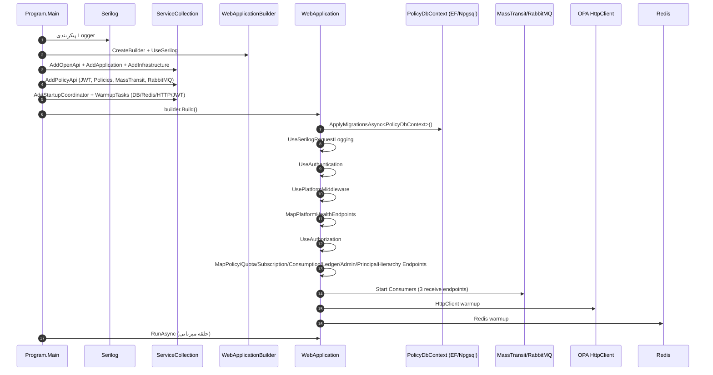
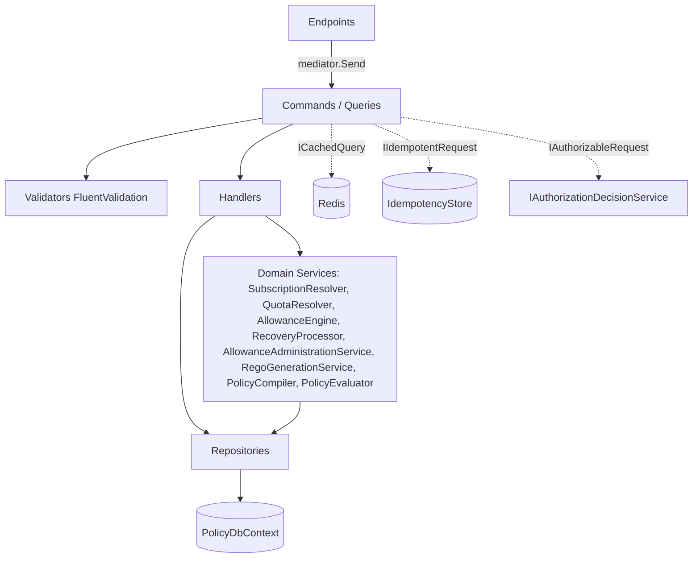
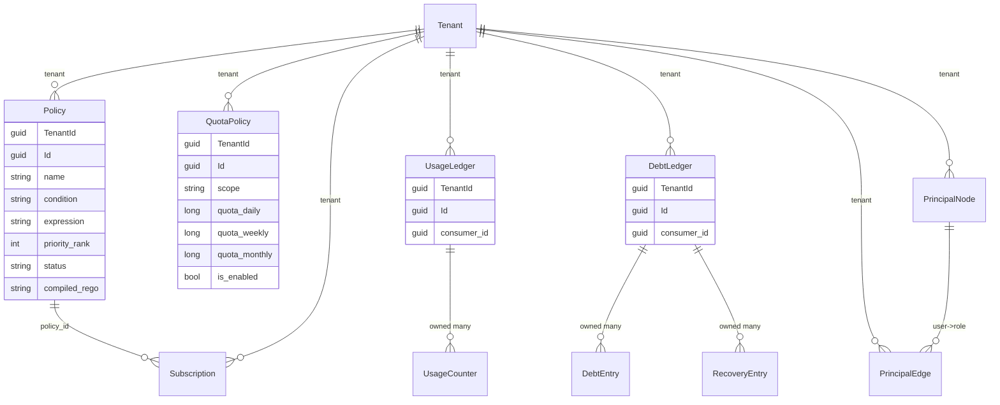
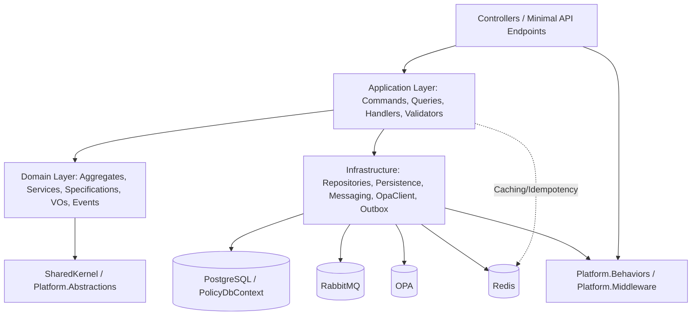
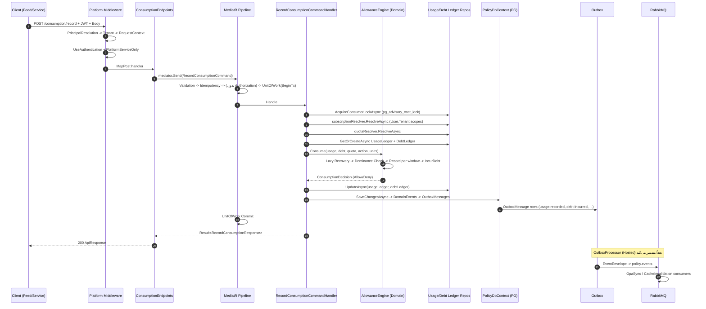
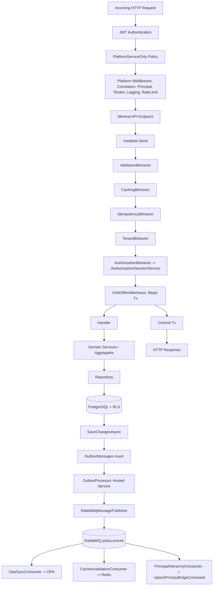

# مستندات معماری سرویس Policy (بازمهندسی معماری)

> مستند تهیه‌شده صرفاً از کد منبع سرویس `PolicyService` در مخزن `Enterprise-Security-Platform`.
> تمام نام‌ها، مسیرها و رفتارها مستقیماً از کد استخراج شده‌اند. مواردی که در کد یافت نشده‌اند، صراحتاً با عبارت **«در کد یافت نشد»** مشخص شده‌اند.

پوشه ریشه سرویس: `src/Services/PolicyService/`
لایه‌ها: `PolicyService.Api` · `PolicyService.Application` · `PolicyService.Domain` · `PolicyService.Infrastructure`
کتابخانه‌های مشترک (Platform): `src/Platform/Platform.Middleware` · `src/Platform/Platform.Behaviors` · `src/Platform/Platform.Abstractions`

---

## ۱. نمای کلان (High-Level Overview)

**مسئولیت سرویس:** `PolicyService` سرویس سیاست‌گذاری و سهمیه (Policy & Quota) پلتفرم امنیت سازمانی است. این سرویس تعریف سیاست‌های ABAC (شرط + عبارت Rego)، اشتراک‌های سیاست (Subscription)، سهمیه‌های پنجره‌ای (QuotaPolicy)، و دفاتر مصرف/بدهی (Usage/Debt Ledger) را مدیریت می‌کند و هسته منطق «مصرف» (Consumption) را اجرا می‌کند.

**هدف تجاری:** پاسخ به این پرسش که «یک عمل (action) برای یک مصرف‌کننده (consumer) با چه شرایطی مجاز است و سقف مصرف (quota) آن چقدر است». برخلاف `AuthorizationService` که «مجوز» (permission) را تعیین می‌کند، این سرویس «شرط» (condition) و «ظرفیت» (allowance) را مدیریت می‌کند (ن. ک. `Policy.cs:9-13`).

**بافت محدود (Bounded Context):** مدیریت سیاست، اشتراک، سهمیه، مصرف و بدهی درون یک tenant. جدا از مفاهیم احراز هویت (Identity)، مجوز (Authorization) و tenant (Tenant) است.

**سرویس‌هایی که به این سرویس وابسته‌اند:**
- `AuthorizationService` (مصرف‌کننده رویدادهای `authorization.role-*` برای هیدراسیون Principal Hierarchy؛ جستار `PrincipalHierarchyConsumer.cs:23-28`)
- هر سرویس Feed/Gateway که مصرف را ثبت می‌کند (فراخوانی `POST /api/v1/consumption/record`)
- `OpaSyncConsumer` رویدادهای این سرویس را به OPA می‌رساند.

**سرویس‌هایی که این سرویس به آن‌ها وابسته است:**
- **PostgreSQL** (`ConnectionStrings:Policy`) — پایگاه داده اصلی.
- **RabbitMQ** (`RabbitMq:ExchangeName = policy.events`) — انتشار/دریافت رویدادها.
- **Redis** (`Redis:ConnectionString`) — کش توزیع‌شده (`IDistributedCacheService`).
- **OPA** (`Opa:BaseUrl = http://localhost:8181`) — همگام‌سازی داده‌های سیاست از طریق `IOpaDataUpdater`.
- **IdentityService / AuthorizationService** — منبع صدور JWT و منبع رویدادهای هیدراسیون سلسله‌مراتب (تنها از طریق رویدادهای MassTransit، بدون فراخوانی HTTP مستقیم در کد یافت شد).

**معماری کلی:** Clean Architecture / CQRS. لایه Domain خالص (بدون وابستگی)، Application (MediatR + FluentValidation)، Infrastructure (EF Core + MassTransit + OPA client)، Api (Minimal APIs). رفتارهای مقطعی (cross-cutting) در `Platform.Behaviors` (پایپ‌لاین MediatR) و `Platform.Middleware` قرار دارند.

---

## ۲. جریان راه‌اندازی (Startup Flow)

نقطه ورود: `PolicyService.Api/Program.cs` → `Program.Main`.

### مراحل به ترتیب

1. **پیکربندی Serilog** (`Program.cs:18-31`): خواندن از `appsettings.json` + متغیرهای محیطی + خط فرمان؛ غنی‌سازی با CorrelationId/ThreadName/MachineName.
2. **ساخت WebApplication** (`Program.cs:37-38`): `UseSerilog`.
3. **OpenAPI + Scalar** (`Program.cs:40-81`): افزودن `AddOpenApi` با transformer ای که دو scheme امنیتی `TenantHeader` (هدر `X-Tenant-Id`) و `Bearer` (JWT) را به همه عملیات اضافه می‌کند.
4. **لیایه برنامه و زیرساخت** (`Program.cs:83`): `AddApplication().AddInfrastructure(builder.Configuration)`.
5. **افزونه‌های API** (`Program.cs:84`): `AddPolicyApi` (جزئیات در ادامه).
6. **هماهنگ‌کننده راه‌اندازی و وظایف گرم‌کننده** (`Program.cs:86-96`):
   - `AddStartupCoordinator()` (`IStartupCoordinator`)
   - `AddDatabaseWarmupTask<PolicyDbContext>()`
   - `AddRedisWarmupTask()`
   - `AddHttpClientWarmupTask(opaUrl)` (آدرس از `Opa:BaseUrl`)
   - `AddJwtWarmupTask(jwtKey, jwtIssuer, jwtAudience)`
7. **ساخت app** (`Program.cs:98`): `builder.Build()`.
8. **اجرای Migrationها** (`Program.cs:100`): `await app.ApplyMigrationsAsync<PolicyDbContext>()`.
9. **محيط Development** (`Program.cs:102-106`): `MapOpenApi()` + `MapScalarApiReference()`.
10. **میدل‌ورها** (`Program.cs:108-113`):
    - `app.UseSerilogRequestLogging();`
    - `app.UseAuthentication();`
    - `app.UsePlatformMiddleware(builder.Configuration);`
    - `app.MapPlatformHealthEndpoints();`
    - `app.UseAuthorization();`
11. **نگاشت endpointها** (`Program.cs:115-121`): `MapPolicyEndpoints`, `MapQuotaPolicyEndpoints`, `MapSubscriptionEndpoints`, `MapConsumptionEndpoints`, `MapLedgerEndpoints`, `MapAdministrationEndpoints`, `MapPrincipalHierarchyEndpoints`.
12. **اجرا** (`Program.cs:123`): `await app.RunAsync();`.

### جزئیات `AddPolicyApi` (`Extensions/ServiceCollectionExtensions.cs`)

- `AddPlatformMiddleware(configuration)` + `AddPlatformBehaviors(configuration)` (رفتارهای MediatR).
- `JwtOptions` از بخش `Jwt` با `ValidateOnStart`.
- **احراز هویت JWT** (`ServiceCollectionExtensions.cs:27-46`): `AddJwtBearer` با `TokenValidationParameters` (ValidateIssuer/Audience/IssuerSigningKey/Lifetime، `ClockSkew=1m`، `NameClaimType="sub"`). در Development `RequireHttpsMetadata=false`.
- **Authorization** (`:48-49`): `AddAuthorization()` + `AddPlatformAuthorizationPolicies()` (تعریف پالیسی‌ها در `Platform.Middleware/AuthorizationPolicyExtensions.cs`).
- **MassTransit + RabbitMQ** (`:54-102`):
  - ثبت ۳ consumer: `PrincipalHierarchyConsumer`، `OpaSyncConsumer`، `CacheInvalidationConsumer`.
  - اتصال به `rabbitmq://{Host}:{Port}/{VirtualHost}` با `PublisherConfirmation=true`.
  - `EventEnvelope` روی exchange `policy.events` از نوع `topic`، durable.
  - `UseMessageRetry` نمایی (۱۰ تلاش).
  - سه ReceiveEndpoint با Quorum Queue + Dead-Letter:
    - `policy.principal-hierarchy` → `policy.principal-hierarchy.dlx/.dlq`
    - `policy.opa-sync` → `policy.opa-sync.dlx/.dlq`
    - `policy.cache-invalidation` → `policy.cache-invalidation.dlx/.dlq`

### جزئیات `AddInfrastructure` (`Infrastructure/DependencyInjection.cs`)

- `AddPlatformInfrastructure()` + `AddPlatformCaching(configuration)`.
- `AddDbContextPool<PolicyDbContext>` با Npgsql، تزریق `TenantRlsInterceptor` و جایگزینی `IMigrationsSqlGenerator` با `RlsMigrationsSqlGenerator`.
- ثبت Repositoryها: `IPolicyRepository`, `ISubscriptionRepository`, `IQuotaPolicyRepository`, `IUsageLedgerRepository`, `IDebtLedgerRepository`, `IPrincipalHierarchyRepository`.
- `OpaOptions` (بخش `Opa`) + `IOpaDataUpdater` (HttpClient).
- `IPolicyUnitOfWork` / `IUnitOfWork`.
- `OutboxPublishPolicy` + `IMessagePublisher` (`RabbitMqMessagePublisher`) + Hosted Service `OutboxProcessor`.

### نمودار Mermaid راه‌اندازی



---

## ۳. API اچ‌تی‌تی‌پی (HTTP API)

تمام endpointها در گروه‌های Minimal API نگاشت شده‌اند و همگی با پالیسی `PlatformAuthorizationPolicies.PlatformServiceOnly` محافظت می‌شوند (یعنی فقط principalهای سرویسی با `principal_type=service` یا `platform_admin=true` مجازند — ن. ک. `AuthorizationPolicyExtensions.cs:14-17`). هیچ OPA evaluation درون endpointها وجود ندارد؛ ارزیابی OPA در Consumer `OpaSyncConsumer` انجام می‌شود (همگام‌سازی داده، نه تصمیم‌گیری فی‌مابPlace).

> نکته: مسیرهای OpenAPI شامل `TenantHeader` (X-Tenant-Id) و `Bearer` هستند، اما در کد endpoint هیچ `[Authorize]` دستی نیست؛ پالیسی روی گروه اعمال شده است.

### ۳.۱ PolicyEndpoints (`Endpoints/PolicyEndpoints.cs`) — گروه `/api/v1/policies`

| متد | مسیر | اکشن | درخواست | پاسخ | هندلر |
|---|---|---|---|---|---|
| POST | `/` | CreatePolicyAsync | `CreatePolicyRequest` (Name, Condition, Expression, Priority=100) | `ApiResponse<CreatePolicyResponse>` 201 | `CreatePolicyCommandHandler` |
| GET | `/` | ListPoliciesAsync | — | `ApiResponse<IReadOnlyCollection<PolicyDto>>` | `ListPoliciesByTenantQueryHandler` |
| GET | `/{id:guid}` | GetPolicyByIdAsync | — | `ApiResponse<PolicyDto>` | `GetPolicyByIdQueryHandler` |
| POST | `/{id:guid}/publish` | PublishPolicyAsync | — | `ApiResponse<Unit>` | `PublishPolicyCommandHandler` |
| POST | `/{id:guid}/archive` | ArchivePolicyAsync | — | `ApiResponse<Unit>` | `ArchivePolicyCommandHandler` |
| PATCH | `/{id:guid}/condition` | ChangePolicyConditionAsync | `ChangePolicyConditionRequest` (Condition, Expression) | `ApiResponse<Unit>` | `ChangePolicyConditionCommandHandler` |

- پالیسی: `PlatformServiceOnly`.
- DTO درخواست/پاسخ: `CreatePolicyRequest`/`CreatePolicyResponse(Guid PolicyId)`/`PolicyDto(Id,Name,Condition,Expression,Priority,Status,CompiledRegoHash)`.
- اعتبارسنجی: `CreatePolicyCommandValidator` (Name/Condition/Expression NotEmpty، Priority>=0).
- رویدادها: `PolicyCreatedDomainEvent`, `PolicyPublishedDomainEvent`, `PolicyArchivedDomainEvent`, `PolicyConditionChangedDomainEvent` (از طریق Outbox).
- عملیات پایگاه‌داده: `IPolicyRepository.AddAsync/UpdateAsync/GetByIdAsync/ListByTenantAsync`.

### ۳.۲ QuotaPolicyEndpoints (`Endpoints/QuotaPolicyEndpoints.cs`) — گروه `/api/v1/quotas`

| متد | مسیر | اکشن | درخواست | پاسخ | هندلر |
|---|---|---|---|---|---|
| POST | `/` | DefineQuotaPolicyAsync | `DefineQuotaPolicyRequest` (ScopeKind, ScopePrincipalId, Daily, Weekly, Monthly) | `ApiResponse<DefineQuotaPolicyResponse>` 201 | `DefineQuotaPolicyCommandHandler` |
| GET | `/{id:guid}` | GetQuotaPolicyByIdAsync | — | `ApiResponse<QuotaPolicyDto>` | `GetQuotaPolicyByIdQueryHandler` |
| GET | `/scope` | ListQuotaPoliciesByScopeAsync | (query) PrincipalKind ScopePrincipalId | `ApiResponse<IReadOnlyCollection<QuotaPolicyDto>>` | `ListQuotaPoliciesByScopeQueryHandler` |
| PATCH | `/{id:guid}` | AmendQuotaPolicyAsync | `AmendQuotaPolicyRequest` (Daily, Weekly, Monthly) | `ApiResponse<Unit>` | `AmendQuotaPolicyCommandHandler` |
| DELETE | `/{id:guid}` | RemoveQuotaPolicyAsync | — | 204 NoContent | `RemoveQuotaPolicyCommandHandler` |
| POST | `/resolve` | ResolveEffectiveQuotaAsync | `ResolveEffectiveQuotaRequest` (CandidateScopes) | `ApiResponse<QuotaPolicyDto>` | `ResolveEffectiveQuotaQueryHandler` (cached) |

- رویدادها: `QuotaPolicyDefinedDomainEvent`, `QuotaPolicyAmendedDomainEvent`, `QuotaPolicyRemovedDomainEvent`.

### ۳.۳ SubscriptionEndpoints (`Endpoints/SubscriptionEndpoints.cs`) — گروه `/api/v1/subscriptions`

| متد | مسیر | اکشن | درخواست | پاسخ | هندلر |
|---|---|---|---|---|---|
| POST | `/` | AssignSubscriptionAsync | `AssignSubscriptionRequest` (PolicyId, ScopeKind, ScopePrincipalId) | `ApiResponse<AssignSubscriptionResponse>` 201 | `AssignSubscriptionCommandHandler` |
| GET | `/{id:guid}` | GetSubscriptionByIdAsync | — | `ApiResponse<SubscriptionDto>` | `GetSubscriptionByIdQueryHandler` |
| GET | `/policy/{policyId:guid}` | ListSubscriptionsByPolicyAsync | — | `ApiResponse<IReadOnlyCollection<SubscriptionDto>>` | `ListSubscriptionsByPolicyQueryHandler` |
| POST | `/{id:guid}/activate` | ActivateSubscriptionAsync | — | `ApiResponse<Unit>` | `ActivateSubscriptionCommandHandler` |
| POST | `/{id:guid}/revoke` | RevokeSubscriptionAsync | — | `ApiResponse<Unit>` | `RevokeSubscriptionCommandHandler` |
| POST | `/{id:guid}/supersede` | SupersedeSubscriptionAsync | — | `ApiResponse<Unit>` | `SupersedeSubscriptionCommandHandler` |
| POST | `/resolve` | ResolveEffectiveSubscriptionAsync | `ResolveEffectiveSubscriptionRequest` (CandidateScopes) | `ApiResponse<SubscriptionDto>` | `ResolveEffectiveSubscriptionQueryHandler` (cached) |

- رویدادها: `SubscriptionAssignedDomainEvent`, `Activated`, `Revoked`, `Superseded`.

### ۳.۴ ConsumptionEndpoints (`Endpoints/ConsumptionEndpoints.cs`) — گروه `/api/v1/consumption`

| متد | مسیر | اکشن | درخواست | پاسخ | هندلر |
|---|---|---|---|---|---|
| POST | `/record` | RecordConsumptionAsync | `RecordConsumptionRequest` (ConsumerId, ActionKey, Units, IdempotencyKey) | `ApiResponse<RecordConsumptionResponse>` | `RecordConsumptionCommandHandler` |
| GET | `/{consumerId:guid}/allowance` | GetAllowanceStatusAsync | (query) actionKey | `ApiResponse<AllowanceStatusDto>` | `GetAllowanceStatusQueryHandler` (cached 30s) |

- `RecordConsumption` علامت‌گذاری شده: `ITransactionalRequest + IIdempotentRequest + IRetryableRequest` و **فاقد** `IAuthorizableRequest` (مطابق ADR-013/018 عملیات سیستمی است — ن. ک. `RecordConsumption.cs:17-25`).
- رویدادها: `UsageRecordedDomainEvent`, `DebtIncurredDomainEvent`, `QuotaExceededDomainEvent`, `OperationAllowed/DeniedDomainEvent`.

### ۳.۵ LedgerEndpoints (`Endpoints/LedgerEndpoints.cs`) — گروه `/api/v1/ledgers`

| متد | مسیر | اکشن | درخواست | پاسخ | هندلر |
|---|---|---|---|---|---|
| GET | `/usage` | GetUsageAsync | (query) consumerId, actionKey, window | `ApiResponse<UsageDto>` | `GetUsageQueryHandler` |
| GET | `/debt` | GetDebtAsync | (query) consumerId, actionKey? | `ApiResponse<DebtSummaryDto>` | `GetDebtQueryHandler` |

### ۳.۶ AdministrationEndpoints (`Endpoints/AdministrationEndpoints.cs`) — گروه `/api/v1/administration`

| متد | مسیر | اکشن | درخواست | پاسخ | هندلر |
|---|---|---|---|---|---|
| POST | `/allowance/reset` | ResetAllowanceAsync | `ResetAllowanceRequest` (ConsumerId) | `ApiResponse<Unit>` | `ResetAllowanceCommandHandler` |

- رویدادها: `UsageResetDomainEvent`, `DebtResetDomainEvent`.

### ۳.۷ PrincipalHierarchyEndpoints (`Endpoints/PrincipalHierarchyEndpoints.cs`) — گروه `/api/v1/principal-hierarchy`

| متد | مسیر | اکشن | درخواست | پاسخ | هندلر |
|---|---|---|---|---|---|
| POST | `/edges` | UpsertPrincipalEdgeAsync | `UpsertPrincipalEdgeRequest` (Operation, NodeId?, UserId?, RoleId?) | `ApiResponse<Unit>` | `UpsertPrincipalEdgeCommandHandler` |

- `PrincipalHierarchyOperation` شامل: `UpsertRoleNode=1, UpsertUserNode=2, UpsertEdge=3, RemoveEdge=4`.

---

## ۴. خط لوله درخواست (Request Pipeline)

ترتیب میدل‌ورها طبق `UsePlatformMiddleware` (`Platform.Middleware/MiddlewareServiceCollectionExtensions.cs:23-50`):

1. `ExceptionHandlingMiddleware` (در صورت فعال بودن)
2. `CorrelationMiddleware`
3. `PrincipalResolutionMiddleware` (ساخت principal از Claims)
4. `TenantMiddleware` (ساخت `RequestContext` از principal + هدر `X-Tenant-Id` برای سرویس‌های با bypass)
5. `SerilogEnrichmentMiddleware`
6. `RequestLoggingMiddleware`
7. `RateLimitingMiddleware`
8. `UseAuthentication` (JWT Bearer)
9. `MapPlatformHealthEndpoints` (قبل از Authorization)
10. `UseAuthorization` (پالیسی `PlatformServiceOnly`)
11. نگاشت endpointها

سپس درون هر درخواست، فراخوانی `mediator.Send` وارد **پایپ‌لاین MediatR (Platform.Behaviors)** می‌شود. ترتیب رفتارها بر اساس پیاده‌سازی‌های موجود (نام فایل‌ها): `Logging → Performance → Metrics → Validation → Caching → Idempotency → Tenant → Authorization → UnitOfWork → FailClosed → Retry`. توجه: ترتیب دقیق ثبت در `BehaviorServiceCollectionExtensions` در کد خوانده‌شده مشخص نشد؛ اما ترتیب منطقی بر اساس وابستگی‌ها: Validation پیش از Handler، Caching/Idempotency پیش از Handler، UnitOfWork دربرگیرنده Handler، Authorization پیش از UnitOfWork.

### نمودار Mermaid خط لوله

```mermaid
flowchart TD
    A[HTTP Request] --> B[ExceptionHandlingMiddleware]
    B --> C[CorrelationMiddleware]
    C --> D[PrincipalResolutionMiddleware]
    D --> E[TenantMiddleware -> RequestContext]
    E --> F[SerilogEnrichment / RequestLogging / RateLimiting]
    F --> G[UseAuthentication JWT]
    G --> H[MapPlatformHealthEndpoints]
    H --> I[UseAuthorization PlatformServiceOnly]
    I --> J{Endpoint Map}
    J --> K[mediator.Send Command/Query]
    K --> L[Logging/Metrics/Performance Behavior]
    L --> M[ValidationBehavior FluentValidation]
    M --> N[CachingBehavior ICachedQuery]
    N --> O[IdempotencyBehavior IIdempotentRequest]
    O --> P[TenantBehavior Guid.Empty check]
    P --> Q[AuthorizationBehavior IAuthorizableRequest]
    Q --> R[UnitOfWorkBehavior ITransactionalRequest]
    R --> S[FailClosedBehavior]
    S --> T[Handler -> Domain Services]
    T --> U[Repositories -> PolicyDbContext]
    U --> V[(PostgreSQL)]
    V --> W[SaveChangesAsync -> OutboxMessages]
    W --> X[Commit / Rollback]
```



---

## ۵. لایه CQRS / برنامه (Application Layer)

تمام دستورات و پرس‌وجوها `+` هندلرها در `PolicyService.Application/Features/` قرار دارند. ثبت از طریق `AddMediatR` (اسکن اسمبلی `CreatePolicyCommandHandler`) و `AddValidatorsFromAssemblyContaining<CreatePolicyCommandValidator>` (`Application/DependencyInjection.cs:23-27`).

### دستورات (Commands)

| دستور | اینترفیس‌ها | هندلر | Validator |
|---|---|---|---|
| `CreatePolicyCommand` | `ITransactional, IAuthorizable, IIdempotent` | `CreatePolicyCommandHandler` | `CreatePolicyCommandValidator` |
| `PublishPolicyCommand` | `ITransactional, IAuthorizable` | `PublishPolicyCommandHandler` | `PublishPolicyCommandValidator` |
| `ArchivePolicyCommand` | `ITransactional, IAuthorizable` | `ArchivePolicyCommandHandler` | `ArchivePolicyCommandValidator` |
| `ChangePolicyConditionCommand` | `ITransactional, IAuthorizable` | `ChangePolicyConditionCommandHandler` | `ChangePolicyConditionCommandValidator` |
| `AssignSubscriptionCommand` | `ITransactional, IAuthorizable, IIdempotent` | `AssignSubscriptionCommandHandler` | `AssignSubscriptionCommandValidator` |
| `ActivateSubscriptionCommand` | `ITransactional, IAuthorizable` | `ActivateSubscriptionCommandHandler` | `ActivateSubscriptionCommandValidator` |
| `RevokeSubscriptionCommand` | `ITransactional, IAuthorizable` | `RevokeSubscriptionCommandHandler` | `RevokeSubscriptionCommandValidator` |
| `SupersedeSubscriptionCommand` | `ITransactional, IAuthorizable` | `SupersedeSubscriptionCommandHandler` | `SupersedeSubscriptionCommandValidator` |
| `DefineQuotaPolicyCommand` | `ITransactional, IAuthorizable, IIdempotent` | `DefineQuotaPolicyCommandHandler` | `DefineQuotaPolicyCommandValidator` |
| `AmendQuotaPolicyCommand` | `ITransactional, IAuthorizable` | `AmendQuotaPolicyCommandHandler` | `AmendQuotaPolicyCommandValidator` |
| `RemoveQuotaPolicyCommand` | `ITransactional, IAuthorizable` | `RemoveQuotaPolicyCommandHandler` | `RemoveQuotaPolicyCommandValidator` |
| `RecordConsumptionCommand` | `ITransactional, IIdempotent, IRetryable` | `RecordConsumptionCommandHandler` | `RecordConsumptionCommandValidator` |
| `ResetAllowanceCommand` | `ITransactional, IAuthorizable, IIdempotent` | `ResetAllowanceCommandHandler` | `ResetAllowanceCommandValidator` |
| `UpsertPrincipalEdgeCommand` | `ITransactional, IIdempotent` | `UpsertPrincipalEdgeCommandHandler` | `UpsertPrincipalEdgeCommandValidator` |

### پرس‌وجوها (Queries)

| پرس‌وجو | پاسخ | هندلر | کش |
|---|---|---|---|
| `ListPoliciesByTenantQuery` | `IReadOnlyCollection<PolicyDto>` | `ListPoliciesByTenantQueryHandler` | — |
| `GetPolicyByIdQuery` | `PolicyDto` | `GetPolicyByIdQueryHandler` | — |
| `GetSubscriptionByIdQuery` | `SubscriptionDto` | `GetSubscriptionByIdQueryHandler` | — |
| `ListSubscriptionsByPolicyQuery` | `IReadOnlyCollection<SubscriptionDto>` | `ListSubscriptionsByPolicyQueryHandler` | — |
| `ResolveEffectiveSubscriptionQuery` | `SubscriptionDto` | `ResolveEffectiveSubscriptionQueryHandler` | `ICachedQuery` (۵ دقیقه) |
| `GetQuotaPolicyByIdQuery` | `QuotaPolicyDto` | `GetQuotaPolicyByIdQueryHandler` | — |
| `ListQuotaPoliciesByScopeQuery` | `IReadOnlyCollection<QuotaPolicyDto>` | `ListQuotaPoliciesByScopeQueryHandler` | — |
| `ResolveEffectiveQuotaQuery` | `QuotaPolicyDto` | `ResolveEffectiveQuotaQueryHandler` | `ICachedQuery` (۵ دقیقه) |
| `GetUsageQuery` | `UsageDto` | `GetUsageQueryHandler` | — |
| `GetDebtQuery` | `DebtSummaryDto` | `GetDebtQueryHandler` | — |
| `GetAllowanceStatusQuery` | `AllowanceStatusDto` | `GetAllowanceStatusQueryHandler` | `ICachedQuery` (۳۰ ثانیه) |

### رفتارهای پایپ‌لاین (Pipeline Behaviors) — همگی در `Platform.Behaviors`
`Logging, Performance, Metrics, Validation, Caching, Idempotency, Tenant, Authorization, UnitOfWork, FailClosed, Retry`. فعال‌سازی آن‌ها از بخش `Behaviors` در `appsettings.json` کنترل می‌شود (`EnableAuthorization, EnableUnitOfWork, EnableIdempotency, EnableCaching, EnableRetry, EnableMetrics, EnablePerformanceWarnings, EnableFailClosed, EnableAudit`).

### نمودار روابط



---

## ۶. پیام‌رسانی (Messaging)

زیرساخت: **MassTransit + RabbitMQ**، exchange `policy.events` (topic, durable). رویدادها به شکل `EventEnvelope` از طریق `IMessagePublisher` (پیاده‌سازی `RabbitMqMessagePublisher`) منتشر می‌شوند. خروج از پایگاه‌داده از طریق **Outbox pattern** (`OutboxProcessor` Hosted Service که از `OutboxMessage` می‌خواند و با `RabbitMqMessagePublisher` منتشر می‌کند — `PolicyDbContext.SaveChangesAsync` رویدادهای دامنه را به `OutboxMessage` تبدیل می‌کند، ن. ک. `PolicyDbContext.cs:50-71`).

### ۶.۱ Consumers (دریافت‌کنندگان)

#### ۱. `PrincipalHierarchyConsumer` — صف `policy.principal-hierarchy`
- پیام: `EventEnvelope` با فیلتر رویدادها: `authorization.role-created.v1`, `authorization.role-assigned.v1`, `authorization.role-revoked.v1` (`PrincipalHierarchyConsumer.cs:23-28`).
- deduplication با TTL ۷ روز (`IEventConsumerDeduplicationGuard`).
- تنظیم `RequestContext` از tenant رویداد (برای RLS) سپس تبدیل به `UpsertPrincipalEdgeCommand` و ارسال به MediatR.
- تغییرات DB: هیدراسیون `PrincipalNode` / `PrincipalEdge` (از طریق `UpsertPrincipalEdgeCommandHandler`).
- رویداد منتشر شده: ندارد (مصرف‌کننده نهایی).

#### ۲. `OpaSyncConsumer` — صف `policy.opa-sync`
- فیلتر: `policy.policy-published.v1`, `policy.policy-archived.v1`.
- deduplication ۷ روز.
- برای published: بارگذاری Policy، ارسال `CompiledRego.Source` به OPA از طریق `IOpaDataUpdater.SyncPolicyDataAsync(documentPath, source)` در مسیر `policy/{tenantId}/{policyId}`.
- برای archived: `SyncPolicyDataAsync(path, null)` (حذف سند از OPA).
- تغییرات DB: فقط خواندن Policy. رویداد خروجی: ندارد.

#### ۳. `CacheInvalidationConsumer` — صف `policy.cache-invalidation`
- فیلتر: ۹ رویداد (published/archived/subscription*/quota*).
- ابطال کلیدهای کش با الگوی `policy:effective-subscription:*Tenant:{id}*` و `policy:effective-quota:*Tenant:{id}*`.
- وابستگی: `IDistributedCacheService`.

### ۶.۲ Publishers (رویدادهای منتشر شده)

تمام رویدادهای زیر از نوع `PolicyDomainEvent` هستند و از طریق Outbox → RabbitMQ منتشر می‌شوند (نام `EventTypeName`):

| رویداد | EventTypeName | منبع (در Domain) |
|---|---|---|
| `PolicyCreatedDomainEvent` | `policy.policy-created.v1` | `Policy.Create` |
| `PolicyPublishedDomainEvent` | `policy.policy-published.v1` | `Policy.Publish` |
| `PolicyArchivedDomainEvent` | `policy.policy-archived.v1` | `Policy.Archive` |
| `PolicyConditionChangedDomainEvent` | `policy.policy-condition-changed.v1` | `Policy.ChangeCondition` |
| `SubscriptionAssignedDomainEvent` | `policy.subscription-assigned.v1` | `Subscription.Create` |
| `SubscriptionActivatedDomainEvent` | `policy.subscription-activated.v1` | `Subscription.Activate` |
| `SubscriptionRevokedDomainEvent` | `policy.subscription-revoked.v1` | `Subscription.Revoke` |
| `SubscriptionSupersededDomainEvent` | `policy.subscription-superseded.v1` | `Subscription.Supersede` |
| `QuotaPolicyDefinedDomainEvent` | `policy.quota-policy-defined.v1` | `QuotaPolicy.Create` |
| `QuotaPolicyAmendedDomainEvent` | `policy.quota-policy-amended.v1` | `QuotaPolicy.Amend` |
| `QuotaPolicyRemovedDomainEvent` | `policy.quota-policy-removed.v1` | `QuotaPolicy.Remove` |
| `UsageRecordedDomainEvent` | `policy.usage-recorded.v1` | `UsageLedger.Record` |
| `UsageResetDomainEvent` | `policy.usage-reset.v1` | `UsageLedger.Reset` |
| `DebtIncurredDomainEvent` | `policy.debt-incurred.v1` | `DebtLedger.IncurDebt` |
| `DebtRecoveredDomainEvent` | `policy.debt-recovered.v1` | `DebtLedger.Recover` |
| `DebtResetDomainEvent` | `policy.debt-reset.v1` | `DebtLedger.Reset` |
| `QuotaExceededDomainEvent` | `policy.quota-exceeded.v1` | `DebtLedger.IncurDebt` |
| `OperationAllowedDomainEvent` | `policy.operation-allowed.v1` | `UsageLedger.MarkAllowed` |
| `OperationDeniedDomainEvent` | `policy.operation-denied.v1` | `UsageLedger.MarkDenied` |

مصرف‌کنندگان این رویدادها در سرویس خودمان: `OpaSyncConsumer` (published/archived) و `CacheInvalidationConsumer` (۹ مورد). سرویس‌های دیگر (مانند AuthorizationService) در کد PolicyService مشخص نشدند.

### نمودار جریان رویداد

```mermaid
flowchart LR
    subgraph Domain
      P[Policy Aggregate]
      S[Subscription Aggregate]
      Q[QuotaPolicy Aggregate]
      U[UsageLedger]
      D[DebtLedger]
    end
    P -->|PolicyPublished/Archived| OUT[OutboxMessages]
    S -->|Subscription*| OUT
    Q -->|Quota*| OUT
    U -->|Usage*| OUT
    D -->|Debt*| OUT
    OUT --> OP[OutboxProcessor Hosted Service]
    OP --> BUS[(RabbitMQ policy.events)]
    BUS --> OH[OpaSyncConsumer -> OPA]
    BUS --> CI[CacheInvalidationConsumer -> Redis invalidate]
    BUS --> PH[PrincipalHierarchyConsumer -> UpsertPrincipalEdgeCommand]
    BUS -. authorization.role-* .-> PH
```

---

## ۷. مدل پایگاه داده (Database Model)

**DbContext:** `PolicyDbContext` (schema = `policy`)، `Persistence/PolicyDbContext.cs`. کلیدهای اصلی ترکیبی `(TenantId, Id)` برای تمام موجودیت‌ها. فیلتر پرس‌وجوی سراسری tenant + soft-delete از طریق `CreateTenantSoftDeleteFilter` (ن. ک. `PolicyDbContext.cs:73-88`).

### DbSets
`Policies, Subscriptions, QuotaPolicies, UsageLedgers, DebtLedgers, PrincipalNodes, PrincipalEdges, OutboxMessages, DeadLetterMessages`.

### موجودیت‌ها و ریشه‌های تجمعی (Aggregate Roots)
هر شش موجودیت اصلی `AggregateRoot` (از `SharedKernel.Domain.Primitives`) هستند: `Policy`, `Subscription`, `QuotaPolicy`, `UsageLedger`, `DebtLedger`, `PrincipalNode`/`PrincipalEdge`.

| جدول | کلاس | کلید | ستون‌های کلیدی | توضیح |
|---|---|---|---|---|
| `policies` | `Policy` | (TenantId, Id) | name, condition(text), expression(text), priority_rank, status, compiled_rego(text) | immutable پس از انتشار |
| `subscriptions` | `Subscription` | (TenantId, Id) | policy_id, scope, status, effective_from | متدهای Activate/Revoke/Supersede |
| `quota_policies` | `QuotaPolicy` | (TenantId, Id) | scope, quota_daily, quota_weekly, quota_monthly (Owned Quota), is_enabled | soft-delete |
| `usage_ledgers` | `UsageLedger` | (TenantId, Id) | consumer_id (unique) | دارای `usage_counters` (Owned Many) |
| `usage_counters` | `UsageCounter` | (TenantId, UsageLedgerId, Action, Window) | action, count, window, window_start, window_end | یک ردیف در هر (action,window) |
| `debt_ledgers` | `DebtLedger` | (TenantId, Id) | consumer_id (unique) | دارای `debt_entries` و `recovery_entries` |
| `debt_entries` | `DebtEntry` | (TenantId, DebtLedgerId, Action) | action, amount | بدهی تکی به ازای action |
| `recovery_entries` | `RecoveryEntry` | (TenantId, DebtLedgerId, Action, Window) | action, window, remaining, window_end | موقعیت بازیابی |
| `principal_nodes` | `PrincipalNode` | (TenantId, NodeId) | node_type(int) | User/Role |
| `principal_edges` | `PrincipalEdge` | (TenantId, UserId, RoleId) | — | یال user→role (soft-delete) |
| `outbox_messages` | `OutboxMessage` | Id | tenant_id, correlation_id, event_type, payload(json) | خروج |
| `dead_letter_messages` | `DeadLetterMessage` | Id | — | پیام‌های مرده |

### Value Objects کلیدی
`PolicyCondition`, `PolicyExpression`, `PolicyPriority`, `RegoModule`, `SubscriptionScope`, `Quota`, `QuotaLimit`, `ConsumerId`, `ActionKey`, `ConsumedUnits`, `ConsumptionDecision`, `DebtAmount`, `DebtEntry`, `RecoveryEntry`, `RecoveryPosition`, `UsageCounter`, `Resource`, `AggregateIdentifier`, `Rego` (ن. ک. پوشه `Domain/ValueObjects`).

### Specifications
- `IQuotaResolutionSpecification` / `QuotaResolutionSpecification` (انتخاب موثرترین QuotaPolicy در زنجیره scope)
- `IDebtDominanceSpecification` / `DebtDominanceSpecification` (تعیین غلبه بدهی)
- `IAllowanceSufficiencySpecification` / `AllowanceSufficiencySpecification`

### نمودار ER (سبک Mermaid)



> نکته: رابطه `Tenant` در اینجا مفهومی است؛ جدول فیزیکی tenant در سرویس دیگر است و ایزولاسیون با ستون `TenantId` + RLS اعمال می‌شود.

---

## ۸. نمودار وابستگی (Dependency Graph)



---

## ۹. مدل امنیتی (Security Pipeline)

### احراز هویت (JWT)
- `AddJwtBearer` با `JwtBearerDefaults.AuthenticationScheme` (`ServiceCollectionExtensions.cs:27`).
- پارامترها از `JwtOptions` (بخش `Jwt`): `Issuer=enterprise-auth-platform`, `Audience=enterprise-services`, `SigningKey`.
- اعتبارسنجی: Issuer, Audience, IssuerSigningKey, Lifetime؛ `ClockSkew=1m`؛ `NameClaimType="sub"`.

### ادعاها (Claims) و نقش‌ها
- `TenantMiddleware` principal را از Claims می‌سازد (`PrincipalResolutionMiddleware` + `ICurrentPrincipalFactory.CreateFromClaimsPrincipal`).
- Claimهای کلیدی برای پالیسی‌ها: `principal_type=service`, `platform_admin=true`, `service_name`, `tenant_id`, `sub`, `user_id`, `department_id`.

### پالیسی‌های Authorization
تنها پالیسی استفاده‌شده در endpointها: **`PlatformServiceOnly`** (ن. ک. `PlatformAuthorizationPolicies.cs:5`). تعریف (`AuthorizationPolicyExtensions.cs:14-17`):

```
RequireAssertion: principal_type == "service" OR platform_admin == "true"
```

پالیسی‌های دیگر تعریف شده‌اند اما در کد PolicyService endpointای به آن‌ها ارجاع ندارد: `RequireIdentityService`, `RequireTenantService`, `RequireAuthorizationService`, `RequireAuditService`, `RequirePolicyService`, `RequireSchedulerService`, `RequireOpaService`, `RequireNotificationService`, `AllowIdentityAndAuthorization`.

### تصمیم‌گیری OPA
- در این سرویس OPA به عنوان **فروشگاه داده** (data sync) استفاده می‌شود نه تصمیم‌گیرنده فی‌مابPlace. `OpaSyncConsumer` سند Rego کامپایل‌شده را در مسیر `policy/{tenantId}/{policyId}` در OPA می‌نویسد (PUT). تنظیمات در `OpaOptions`: `BaseUrl`, `PolicyPath=/v1/data/policy/allow`, `TimeoutMs=1000`, `CircuitBreakerThreshold=5`, `CircuitBreakerDurationSeconds=30`, `RetryCount=2`.
- هیچ فراخوانی ارزیابی (`/v1/data/policy/allow`) در کد PolicyService یافت نشد؛ ارزیابی نهایی در AuthorizationService انجام می‌شود (خارج از این سرویس).

### جداسازی Tenant (Tenant Isolation)
- تمام جداول کلید ترکیبی `(TenantId, Id)` دارند.
- فیلتر پرس‌وجوی سراسری در `PolicyDbContext` (`CreateTenantSoftDeleteFilter`) ردیف‌های tenant دیگر و soft-deleted را پنهان می‌کند، مگر اینکه `CanBypassTenantIsolation=true` باشد.
- `TenantRlsInterceptor` (تزریق‌شده در DbContext) و `RlsMigrationsSqlGenerator` جداسازی سطح پایگاه‌داده (RLS) را اعمال می‌کنند.
- `TenantBehavior` در پایپ‌لاین MediatR اگر `TenantId == Guid.Empty` و غیرِ bypass باشد، خطای `TenantMissing` برمی‌گرداند.

### جداسازی Department
- `RequestContext.DepartmentId` از principal خوانده می‌شود (`TenantMiddleware.cs:59`)، اما در کد PolicyService استفاده‌ی خاصی از آن (مثلاً فیلتر query) یافت نشد.

### احراز هویت سرویس به سرویس (Service-to-Service)
- سرویس‌های دیگر با JWT حامل ادعای `principal_type=service` و `service_name` وارد می‌شوند. `PlatformServiceOnly` دقیقاً همین را بررسی می‌کند. در Development، سرویس‌ها می‌توانند tenant را با هدر `X-Tenant-Id` (در صورت `CanBypassTenantIsolation`) بازنویسی کنند (`TenantMiddleware.TryGetTenantOverride`).

### نمودار جریان تصمیم Authorization

```mermaid
flowchart TD
    A[HTTP Request + JWT] --> B[UseAuthentication: اعتبارسنجی JWT]
    B --> C[UseAuthorization: پالیسی PlatformServiceOnly]
    C -->|principal_type=service؟| D[Allowed]
    C -->|platform_admin=true؟| D
    C -->|otherwise| E[403 Forbidden]
    D --> F[Endpoint -> mediator.Send]
    F --> G{Request is IAuthorizableRequest؟}
    G -->|No (مثل RecordConsumption)| H[skip AuthorizationBehavior]
    G -->|Yes| I{IsService یا CanBypassTenantIsolation؟}
    I -->|Yes| J[next]
    I -->|No| K[IAuthorizationDecisionService.DecideAsync]
    K -->|Allowed| J
    K -->|Denied| L[Error.Forbidden / 403]
    J --> M[Handler]
```

---

## ۱۰. یکپارچگی‌های خارجی (External Integrations)

| یکپارچگی | نحوه استفاده | کلاس/تنظیم |
|---|---|---|
| **PostgreSQL** | پایگاه داده اصلی (Npgsql)، schema `policy`، RLS | `PolicyDbContext`, `ConnectionStrings:Policy` |
| **Redis** | کش توزیع‌شده (`IDistributedCacheService`) برای `ICachedQuery` و ابطال کش | `AddPlatformCaching`, `Redis:ConnectionString`, `Redis:InstanceName=policy` |
| **RabbitMQ** | MassTransit bus، exchange `policy.events` (topic)، ۳ receive endpoint | `RabbitMqOptions`, `RabbitMqMessagePublisher`, `OutboxProcessor` |
| **OPA** | همگام‌سازی داده سیاست (PUT داده Rego) | `IOpaDataUpdater`/`OpaDataUpdater`, `OpaOptions` |
| **Identity Provider** | صادرکننده JWT (خارجی؛ فقط اعتبارسنجی کلید در `JwtBearerOptions`) | `JwtOptions`, `Jwt:Issuer/Audience/SigningKey` |
| **AuthorizationService** | منبع رویدادهای `authorization.role-*` برای هیدراسیون | `PrincipalHierarchyConsumer` (مصرف از طریق MassTransit) |
| **HTTP Clients دیگر** | **در کد PolicyService یافت نشد** (هیچ `HttpClient` مستقیم برای فراخوانی سرویس دیگر دیده نشد؛ فقط `IOpaDataUpdater` روی OPA) | — |

---

## ۱۱. چرخه حیات زمان اجرا (Runtime Lifecycle) — یک درخواست نمونه

مسیر `POST /api/v1/consumption/record` (گرم‌ترین مسیر؛ UC-20):



---

## ۱۲. معماری پوشه‌ها (Folder Architecture)

| پوشه | هدف |
|---|---|
| `PolicyService.Api/Endpoints` | نگاشت Minimal API (۷ فایل endpoint) + Extensions (ثبت JWT/MassTransit/پالیسی‌ها) |
| `PolicyService.Api/Properties` | تنظیمات assembly |
| `PolicyService.Application/Features` | دستورات، پرس‌وجوها، هندلرها، Validatorها (گروه‌بندی Policies/Subscriptions/QuotaPolicies/Consumption/Ledgers/Administration/PrincipalHierarchy) |
| `PolicyService.Application/Abstractions` | اینترفیس‌های لایه برنامه (مانند `IOpaDataUpdater`) |
| `PolicyService.Application/DependencyInjection.cs` | ثبت MediatR + Validators + سرویس‌های دامنه |
| `PolicyService.Domain/Aggregates` | ریشه‌های تجمعی: Policies, Subscriptions, QuotaPolicies, UsageLedgers, DebtLedgers, PrincipalHierarchy |
| `PolicyService.Domain/Entities` | موجودیت‌های تابع (PrincipalNode, PrincipalEdge) |
| `PolicyService.Domain/ValueObjects` | اشیاء مقدار (Rego, ActionKey, Quota, DebtAmount, ...) |
| `PolicyService.Domain/Services` | سرویس‌های خالص دامنه (Resolvers, AllowanceEngine, RecoveryProcessor, RegoGeneration, PolicyCompiler, PolicyEvaluator, AllowanceAdministration) |
| `PolicyService.Domain/Specifications` | مشخصات (QuotaResolution, DebtDominance, AllowanceSufficiency) |
| `PolicyService.Domain/Repositories` | اینترفیس‌های Repository |
| `PolicyService.Domain/Events` | رویدادهای دامنه (`PolicyDomainEvent` پایه) |
| `PolicyService.Domain/Enums` | PrincipalKind, QuotaWindow, SubscriptionStatus, PolicyStatus, ConsumptionDecisionType |
| `PolicyService.Domain/{Errors,Exceptions,Constants,Rules,Models,Factories,Extensions,Interfaces}` | پشتیبانی دامنه |
| `PolicyService.Infrastructure/Persistence` | `PolicyDbContext`, `PolicyUnitOfWork`, Configurations (EF mappings) |
| `PolicyService.Infrastructure/Repositories` | پیاده‌سازی Repositoryها |
| `PolicyService.Infrastructure/Messaging/Consumers` | ۳ Consumer (PrincipalHierarchy, OpaSync, CacheInvalidation) |
| `PolicyService.Infrastructure/Messaging/RabbitMq` | `RabbitMqMessagePublisher`, `RabbitMqOptions` |
| `PolicyService.Infrastructure/OpaClient` | `OpaDataUpdater`, `OpaOptions` |
| `PolicyService.Infrastructure/Outbox` | `OutboxProcessor` (Hosted Service) |
| `PolicyService.Infrastructure/Migrations` | Migrationهای EF (InitialCreate + اصلاح کلیدهای owned collection) |
| `PolicyService.Infrastructure/DependencyInjection.cs` | ثبت DbContext، Repository، OPA، UnitOfWork، MassTransit publisher |

---

## ۱۳. پیکربندی (Configuration)

### `appsettings.json`

| بخش | کلیدها | کلاس Options | توضیح |
|---|---|---|---|
| `ConnectionStrings:Policy` | رشته Npgsql | — | پایگاه داده |
| `Redis` | ConnectionString, InstanceName=policy | — | کش |
| `Opa` | BaseUrl, PolicyPath=/v1/data/policy/allow, TimeoutMs=1000, CircuitBreakerThreshold=5, CircuitBreakerDurationSeconds=30, RetryCount=2 | `OpaOptions` | همگام‌سازی OPA |
| `RabbitMq` | Host, Port=5672, VirtualHost=/, Username, Password, ExchangeName=policy.events | `RabbitMqOptions` | MassTransit |
| `Outbox` | BatchSize=50, PollIntervalMilliseconds=10000, LeaseDurationSeconds=60, MaxAttempts=10 | `OutboxPublishPolicy` | پردازش Outbox |
| `Jwt` | Issuer=enterprise-auth-platform, Audience=enterprise-services | `JwtOptions` | احراز هویت (SigningKey فقط در Development) |
| `Behaviors` | EnableAuthorization, EnableUnitOfWork, EnableIdempotency, EnableCaching, EnableRetry, EnableMetrics, EnablePerformanceWarnings, EnableFailClosed, EnableAudit=false | `BehaviorOptions` | فعال‌سازی رفتارها |
| `Serilog` | MinimumLevel, WriteTo Console | — | لاگ‌برداری |

### متغیرهای محیطی
- `ASPNETCORE_ENVIRONMENT` (تعیین فایل appsettings.{ENV}.json).
- مقادیر از طریق `AddEnvironmentVariables()` و `AddCommandLine` در `Program.cs:22-23` بارگذاری می‌شوند.

### `appsettings.Development.json`
- `Jwt:SigningKey = development-signing-key-change-in-secret-store-minimum-32-bytes` (فقط Development).

### Secrets
- `Jwt:SigningKey` در Production باید از secret store تامین شود (در کد محلی مقدار ندارد؛ `JwtOptions.SigningKey` مقدار پیش‌فرض خالی با `[Required]`). در کد مقدار پیش‌فرض دیگری یافت نشد.

### پایبندی (Binding)
- `services.AddOptions<OpaOptions>().BindConfiguration("Opa").ValidateOnStart();`
- `services.AddOptions<RabbitMqOptions>().BindConfiguration("RabbitMq").ValidateOnStart();`
- `services.Configure<OutboxPublishPolicy>(configuration.GetSection("Outbox"));`
- `JwtOptions` با `BindConfiguration("Jwt").ValidateDataAnnotations().ValidateOnStart();`

---

## ۱۴. نقشه کامل خط لوله (End-to-End)



---

## ضمیمه: یافته‌های تکمیلی از کد

- **قفل همزمانی مصرف:** `UsageLedgerRepository.AcquireConsumerLockAsync` از `pg_advisory_xact_lock` برای سریال‌سازی نوشته‌های هم‌زمان روی یک consumer استفاده می‌کند (رفع race روی `Version` CAS — ن. ک. `RecordConsumption.cs:68-75`).
- **مدل بدهی:** بدهی «تکی به ازای (consumer, action)» بدون محور window است؛ بازیابی (recovery) بدهت‌اول روی هر تجدید پنجره اعمال می‌شود (`DebtLedger.cs`, `AllowanceEngine.cs`).
- **Reset اداری:** فقط usage + debt را پاک می‌کند و هرگز QuotaPolicy را تغییر نمی‌دهد (`ResetAllowance.cs:17-21`).
- **سیاست منتشر شده تغییرناپذیر** است (`Policy.ChangeCondition` برای `Published` خطا می‌دهد — `Policy.cs:71-84`).
- **میراث RLS:** `TenantRlsInterceptor` و `RlsMigrationsSqlGenerator` در `PolicyDbContext` تزریق شده‌اند اما پیاده‌سازی دقیق آن‌ها در این گزارش خوانده نشد (در `Platform.Infrastructure` قرار دارند).

> تمام ارجاعات به خطوط فایل‌ها (مثل `Policy.cs:9`) مستقیماً از کد خوانده‌شده استخراج شده‌اند. مواردی که صراحتاً «یافت نشد» علامت‌گذاری شدند، در کد منبع سرویس Policy موجود نبودند.
