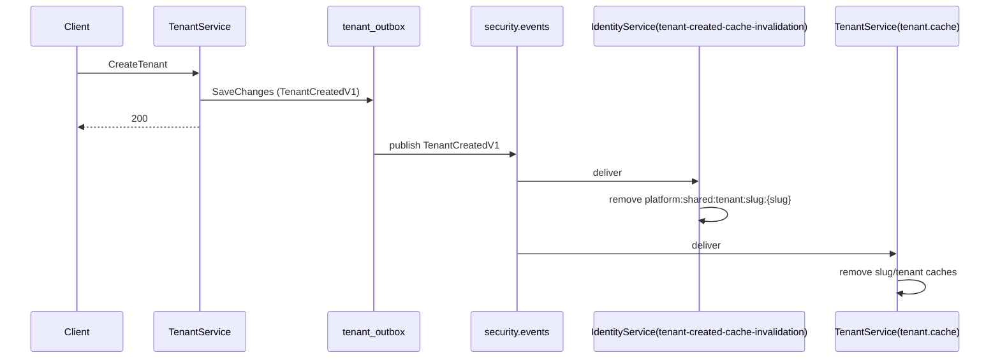
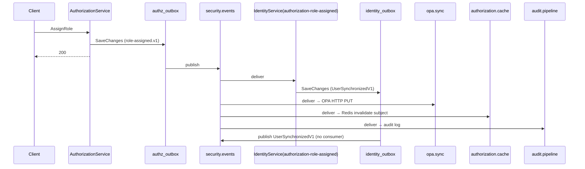
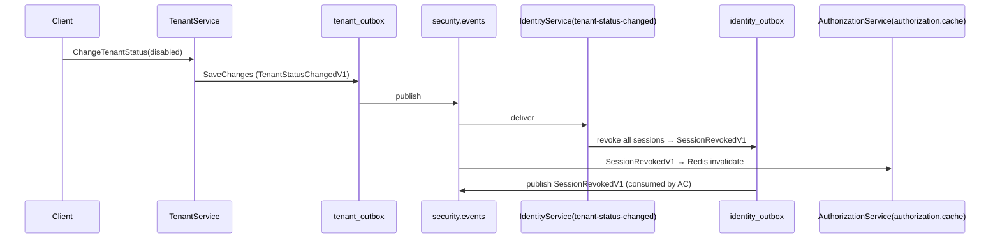
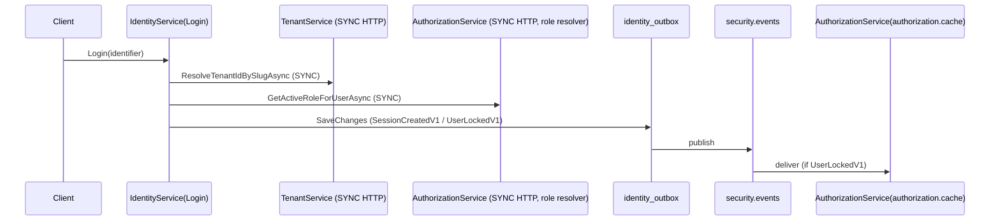
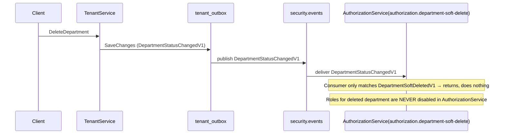

# RabbitMQ / MassTransit Messaging Architecture Report

> **Discovery-only report.** No code was modified. Every statement cites source evidence as `file:line`.
> Solution: `Enterprise-Security-Platform` (3 services + SharedKernel + Platform).

---

> **⚠️ STATUS UPDATE (2026-07-14).** Two of the headline risks below are now **RESOLVED**:
> - **Risk #1 (`DepartmentSoftDeleteConsumer` is dead)** — RESOLVED by Phase 1 (MSG-001..004, commit `70b00d8`). TenantService now publishes `DepartmentSoftDeletedV1` on department deletion (`TenantDomainEvents.cs:118`, `DeleteDepartmentCommandHandler.cs:25,31`), and the consumer disables the department's roles → produces `authorization.role-disabled.v1`. See `docs/reports/PHASE-1-IMPLEMENTATION-REPORT.md` and `docs/reports/PRODUCTION-HARDENING-REPORT.md`.
> - **Risk #2 (IdentityService no retry/DLQ)** — RESOLVED by MSG-003. IdentityService now configures `UseMessageRetry(Exponential(10,1s,30s,5s))` plus `SetQuorumQueue()` + `BindDeadLetterQueue` on all three consumer endpoints (`IdentityService...ServiceCollectionExtensions.cs:158,163-180`).
>
> The body of this report still describes the **pre-remediation** state and should be treated as historical. `docs/reports/PRODUCTION-HARDENING-REPORT.md` is authoritative for current state.

# Executive Summary

The platform uses a **single shared RabbitMQ topic exchange** (`security.events`, configurable via `RabbitMq:ExchangeName`) and a **transactional outbox** per service. Every integration event is serialized as one generic contract — `SharedKernel.Contract.Events.EventEnvelope` — and published via `MassTransit IBus.Publish`. Because all consumers implement `IConsumer<EventEnvelope>`, **every consumer queue is bound to the same exchange with the same routing key and therefore receives every message**; filtering is done *client-side* by string-matching `envelope.EventType`.

- **3 services**: `IdentityService`, `TenantService`, `AuthorizationService`.
- **9 consumer queues** total (3 Identity, 1 Tenant, 5 Authorization).
- **No sagas**, no `ReceiveEndpoint` fan-in routing, no per-message-type exchanges.
- **Outbox** is the delivery guarantee: domain events raised on aggregates are flushed to a per-database `OutboxMessages` table inside the same transaction as the business write (driven by `UnitOfWorkBehavior`), then a hosted `BackgroundService` (`OutboxProcessorBase<T>`) polls and publishes.

**Headline risks (detailed in later sections):**
1. **`DepartmentSoftDeleteConsumer` is dead** — it waits for `DepartmentSoftDeletedV1`, an event **no service in the repository ever publishes** (TenantService deletes departments by emitting `DepartmentStatusChangedV1` instead). Department deletion therefore does **not** propagate role disabling to AuthorizationService. *(Critical)*
2. **IdentityService has no MassTransit retry or RabbitMQ DLQ** (unlike the other two services), relying solely on the DB outbox retry → DB dead-letter table.
3. **Every queue receives every event** (fan-out to all). This is wasteful and couples all consumers to all event types.
4. Multiple **dead/orphaned events and consumer switch-cases** exist (e.g. `UserLoggedInV1`, `MfaVerifiedV1`, `authorization.role-activated.v1`, …).
5. **Synchronous HTTP still couples the services at request time** (login resolution, authorization decisions, OPA) — messaging decouples *propagation* but not *runtime dependencies*.

---

# Messaging Overview

| Concern | Finding | Evidence |
|---|---|---|
| Broker | RabbitMQ via MassTransit `UsingRabbitMq` | `IdentityService.Api/Extensions/ServiceCollectionExtensions.cs:141`, `AuthorizationService.Api/Extensions/ServiceCollectionExtensions.cs:69`, `TenantService.Infrastructure/DependencyInjection.cs:107` |
| Exchange | Single topic exchange, name from `RabbitMq:ExchangeName` (default `security.events`), `Durable=true`, `ExchangeType="topic"` | `RabbitMqOptions.cs` (each service); publish cfg `AuthorizationService...ServiceCollectionExtensions.cs:80-86`, `TenantService...DependencyInjection.cs:118-124`, Identity `:151-157` |
| Message contract | `EventEnvelope` (one generic type for all events) | `SharedKernel/Contract/Events/EventEnvelope.cs` |
| Consumer contract | `IConsumer<EventEnvelope>` + client-side `EventType` switch | e.g. `AuthorizationCacheInvalidationConsumer.cs:12,33` |
| Delivery guarantee | Transactional Outbox → `BackgroundService` publisher | `Platform/Platform.Infrastructure/Outbox/OutboxProcessorBase.cs:24-97` |
| Retry / DLQ | Auth & Tenant: `UseMessageRetry` exponential(10) + quorum + RabbitMQ DLQ (`.dlx`/`.dlq`). Identity: **none at bus level** | `AuthorizationService...:88,93-122`; `TenantService...:126,128-133`; Identity `:135-160` (no retry/DLQ) |
| Versioning | Every event hard-codes `Version = 1`; `EventTypeName` strings redundantly embed `V1` | `IdentityDomainEvents.cs:9`, `TenantDomainEvents.cs:9`, `AuthorizationDomainEvents.cs:11` |
| Sagas | **None** | `grep "Saga" → no matches` |

---

# RabbitMQ Topology

### Exchange
- **One** topic exchange, entity name = `options.ExchangeName` (default `security.events`). Configured identically in all three services:
  - Identity: `ServiceCollectionExtensions.cs:151-157`
  - Authorization: `ServiceCollectionExtensions.cs:80-86`
  - Tenant: `DependencyInjection.cs:118-124`

### Binding / Routing (critical architectural property)
MassTransit binds each `ReceiveEndpoint` for `IConsumer<EventEnvelope>` to the exchange using the **message-type routing key** (`EventEnvelope`). Because the published contract is *always* `EventEnvelope` regardless of the business event, **every queue is bound with the same routing key and every queue receives a copy of every envelope**. Routing is not used to separate events; separation happens by `EventType` string inside each consumer.

Evidence of fan-out: every consumer is `IConsumer<EventEnvelope>` (e.g. `OpaSyncConsumer.cs:13`, `TenantCacheInvalidationConsumer.cs:13`, `AuthorizationRoleAssignedConsumer.cs:16`); the publish type is `EventEnvelope` (`RabbitMqMessagePublisher.cs:14` in each service). All queues attach to the same topic exchange.

### Queues and Dead-Letter topology
| Service | Queue | Quorum | DLX / DLQ | Evidence |
|---|---|---|---|---|
| Authorization | `authorization.cache` | yes | `authorization.cache.dlx` / `authorization.cache.dlq` | `ServiceCollectionExtensions.cs:93-98` |
| Authorization | `audit.pipeline` | yes | `audit.pipeline.dlx` / `audit.pipeline.dlq` | `:99-104` |
| Authorization | `opa.sync` | yes | `opa.sync.dlx` / `opa.sync.dlq` | `:105-110` |
| Authorization | `analytics.pipeline` | yes | `analytics.pipeline.dlx` / `analytics.pipeline.dlq` | `:111-116` |
| Authorization | `authorization.department-soft-delete` | yes | `authorization.department-soft-delete.dlx` / `.dlq` | `:117-122` |
| Tenant | `tenant.cache` | yes | `tenant.cache.dlx` / `tenant.cache.dlq` | `DependencyInjection.cs:128-133` |
| Identity | `authorization-role-assigned` | default (classic) | **none** | `ServiceCollectionExtensions.cs:137,140,158` (`ConfigureEndpoints`, no DLQ) |
| Identity | `tenant-created-cache-invalidation` | default | **none** | same |
| Identity | `tenant-status-changed` | default | **none** | same |

> **Topology asymmetry:** AuthorizationService and TenantService use explicit `ReceiveEndpoint(...)` with **quorum queues + RabbitMQ DLQs + `UseMessageRetry`**. IdentityService relies on `ConfigureEndpoints` (kebab-case queue names) and configures **no retry, no quorum, no RabbitMQ DLQ** — only the DB-level outbox retry (`OutboxPublishPolicy.MaxAttempts=10`) and a DB `DeadLetterMessage` table.

---

# MassTransit Configuration

### Common wiring (all three services)
```
AddMassTransit(cfg => {
    cfg.AddConsumer<...>();
    cfg.UsingRabbitMq((context, cfg) => {
        cfg.Host(rabbitmq://..., h => { h.Username; h.Password; h.PublisherConfirmation = true; });
        cfg.Message<EventEnvelope>(m => m.SetEntityName(options.ExchangeName));
        cfg.Publish<EventEnvelope>(p => { p.Durable = true; p.ExchangeType = "topic"; });
        // Authorization & Tenant also: cfg.UseMessageRetry(...); cfg.ReceiveEndpoint(...).BindDeadLetterQueue(...)
        cfg.ConfigureEndpoints(context);   // Identity only (auto queue names)
    });
});
services.AddSingleton<IMessagePublisher, RabbitMqMessagePublisher>();
services.AddHostedService<XxxOutboxProcessor>();   // or IdentityOutboxDispatcher
```

### Publisher
- `RabbitMqMessagePublisher : IMessagePublisher` calls `bus.Publish(envelope, ctx => { ctx.CorrelationId=...; ctx.Headers.Set("tenant_id",...); if(CausationId) ctx.Headers.Set("causation_id",...); })` — `IdentityService...RabbitMqMessagePublisher.cs:12-29`, `AuthorizationService...:8-29`, `TenantService...:8-29`.
- `RabbitMqOptions.ExchangeName` default `security.events` — `RabbitMqOptions.cs:23` (each service).

### Outbox (the actual delivery mechanism)
- `OutboxProcessorBase<TDbContext> : BackgroundService` — `Platform/Platform.Infrastructure/Outbox/OutboxProcessorBase.cs`. Polls `ClaimPendingBatchAsync` (default BatchSize=50, Poll=10000ms, Lease=60s, MaxAttempts=10 — `OutboxPublishPolicy.cs`), rehydrates `EventEnvelope`, calls `IMessagePublisher.PublishAsync`, then `MarkProcessedAsync`. On `RetryCount >= MaxAttempts` → `MoveToDeadLetterAsync` (inserts DB `DeadLetterMessage`, *not* a RabbitMQ DLQ).
- Domain-event capture happens in each `DbContext.SaveChangesAsync` (e.g. `IdentityDbContext.cs:50-58,164-213`; `AuthorizationDbContext.cs:44-94`; `TenantDbContext.cs:46-200`).
- The flush is triggered by `UnitOfWorkBehavior` for `ITransactionalRequest` commands — `Platform/Platform.Behaviors/UnitOfWorkBehavior.cs:16,33` → `SaveChangesAsync` → outbox rows committed atomically with the aggregate.

### Deduplication
- Consumers guard with `IEventConsumerDeduplicationGuard.TryBeginProcessingAsync(consumerName, EventId, 7-day TTL, ct)` (Redis) before acting — e.g. `AuthorizationCacheInvalidationConsumer.cs:20`, `DepartmentSoftDeleteConsumer.cs:27`, `OpaSyncConsumer.cs:37`, `TenantCreatedCacheInvalidationConsumer.cs:15`. This makes consumers idempotent against at-least-once redelivery.

---

# Exchanges

| Exchange | Type | Durable | Producers | Bound queues (receive ALL events) |
|---|---|---|---|---|
| `security.events` (default) | topic | yes | All 3 services (via `RabbitMqMessagePublisher`) | `authorization.cache`, `audit.pipeline`, `opa.sync`, `analytics.pipeline`, `authorization.department-soft-delete`, `tenant.cache`, `authorization-role-assigned`, `tenant-created-cache-invalidation`, `tenant-status-changed` |

There is **one** exchange. No per-event exchanges, no request/response exchanges. All event types are multiplexed onto this single exchange.

---

# Queues

See "RabbitMQ Topology → Queues" above for the 9 queues, quorum/DLQ settings, and evidence.

---

# Consumers

## IdentityService (3)
| Queue (derived) | Consumer | EventType(s) handled | Side-effects | Evidence |
|---|---|---|---|---|
| `authorization-role-assigned` | `AuthorizationRoleAssignedConsumer` | `authorization.role-assigned.v1` | Loads user cross-tenant, `user.SynchronizeTenant(...)` → raises `UserSynchronizedDomainEvent`; `SaveChangesAsync`. **Produces `UserSynchronizedV1`.** | `AuthorizationRoleAssignedConsumer.cs:21,35-61` |
| `tenant-created-cache-invalidation` | `TenantCreatedCacheInvalidationConsumer` | `TenantCreatedV1` | Removes `platform:shared:tenant:slug:{slug}` from distributed cache. | `TenantCreatedCacheInvalidationConsumer.cs:21,30-42` |
| `tenant-status-changed` | `TenantStatusChangedConsumer` | `TenantStatusChangedV1` | If `NewStatus` ∈ {disabled, suspended} → revoke all tenant sessions (`session.Revoke`) → raises `SessionRevokedDomainEvent`; `SaveChangesAsync`. **Produces `SessionRevokedV1`.** | `TenantStatusChangedConsumer.cs:21,35-55` |

None of the three IdentityService consumers make synchronous HTTP calls.

## TenantService (1)
| Queue | Consumer | EventType(s) handled | Side-effects | Evidence |
|---|---|---|---|---|
| `tenant.cache` | `TenantCacheInvalidationConsumer` | `TenantCreatedV1` (slug cache); `TenantStatusChangedV1` + `TenantPlanUpgradedV1` (tenant cache); `DepartmentCreatedV1` + `DepartmentStatusChangedV1` (department cache) | Removes cache keys only. **No DB change, no outbound event, no HTTP.** | `TenantCacheInvalidationConsumer.cs:27-104` |

Note: this consumer reacts to **TenantService's own** outbound events for local cache invalidation; it does **not** consume events from other services. `TenantNameUpdatedV1`, `DepartmentNameUpdatedV1`, `DepartmentDescriptionUpdatedV1` have **no case** → hit `default` and are silently ignored (cache not invalidated).

## AuthorizationService (5)
| Queue | Consumer | EventType(s) handled | Side-effects / outbound | Evidence |
|---|---|---|---|---|
| `authorization.cache` | `AuthorizationCacheInvalidationConsumer` | User lifecycle (`UserRegisteredV1`, `UserLoggedInV1`*, `UserActivatedV1`, `UserLockedV1`, `UserUnlockedV1`, `UserDisabledV1`, `UserDeletedV1`, `MfaEnabledV1`, `MfaVerifiedV1`*, `SessionRevokedV1`) + `authorization.role-assigned.v1`, `.role-revoked.v1`, `.permission-granted.v1`, `.permission-revoked.v1` | Invalidates Redis authz cache (subject or whole tenant). No DB, no HTTP. | `AuthorizationCacheInvalidationConsumer.cs:33-66`; `Caching/CacheInvalidationConsumer.cs` |
| `audit.pipeline` | `AuditPipelineConsumer` | **ALL envelopes** (no `EventType` guard) | `IAuthorizationAuditSink.RecordStateChangeAsync` → `LoggingAuthorizationAuditSink` (logging only). No DB, no HTTP. | `AuditPipelineConsumer.cs:21,29-41` |
| `opa.sync` | `OpaSyncConsumer` | Structural set: `authorization.role-created/-activated/-deactivated/-disabled/-parent-changed.v1`, `authorization.role-assigned/-revoked.v1`, `authorization.permission-granted/-revoked.v1` | **Synchronous HTTP PUT to OPA** (`IOpaDataUpdater.SyncPolicyDataAsync`). | `OpaSyncConsumer.cs:17-52`; `OpaDataUpdater.cs:13-21` |
| `analytics.pipeline` | `AnalyticsPipelineConsumer` | **ALL envelopes** | `IAnalyticsEventSink.PushEventAsync` → `AnalyticsEventSink` (logging only). | `AnalyticsPipelineConsumer.cs:20,32-38` |
| `authorization.department-soft-delete` | `DepartmentSoftDeleteConsumer` | `DepartmentSoftDeletedV1` (**never produced — dead**) | If matched: disable roles for department → raises `RoleDisabledDomainEvent` → produces `authorization.role-disabled.v1`. | `DepartmentSoftDeleteConsumer.cs:18,24,46-65` |

`*` = `UserLoggedInV1` and `MfaVerifiedV1` are dead switch-cases (never produced — see Dead Messaging).

---

# Publishers

Each service publishes via `RabbitMqMessagePublisher` → `bus.Publish(envelope)`. The envelope is built from a domain event inside `DbContext.SaveChangesAsync` (outbox). Producers are the **command handlers** that mutate aggregates.

## IdentityService publishers (outbox → `security.events`)
| EventType | Version | Producing operation | Domain event | Evidence |
|---|---|---|---|---|
| `UserRegisteredV1` | 1 | `Register` | `UserRegisteredDomainEvent` | `RegisterCommandHandler.cs:59` → `User.Register` (`User.cs:40`) |
| `SessionCreatedV1` | 1 | `Login` (success) | `SessionCreatedDomainEvent` | `LoginCommandHandler.cs:128` → `Session.Create` (`Session.cs:37`) |
| `UserLockedV1` | 1 | `Login` (bad password + `ShouldLock`) | `UserLockedDomainEvent` | `LoginCommandHandler.cs:100` → `User.Lockout` (`User.cs:252`) |
| `MfaEnabledV1` | 1 | `EnableMfa` | `MfaEnabledDomainEvent` | `EnableMfaCommandHandler.cs:41` → `User.EnableMfa` (`User.cs:182`) |
| `UserActivatedV1` | 1 | `ActivateUser` | `UserActivatedDomainEvent` | `ActivateUserCommandHandler.cs:38` → `User.Activate` (`User.cs:82`) |
| `UserUnlockedV1` | 1 | `UnlockUser` | `UserUnlockedDomainEvent` | `UnlockUserCommandHandler.cs:41` → `User.Unlock` (`User.cs:107`) |
| `UserDisabledV1` | 1 | `DisableUser` | `UserDisabledDomainEvent` | `DisableUserCommandHandler.cs:38` → `User.Disable` (`User.cs:120`) |
| `UserDeletedV1` | 1 | `DeleteUser` | `UserDeletedDomainEvent` | `DeleteUserCommandHandler.cs:38` → `User.Delete` (`User.cs:134`) |
| `SessionRevokedV1` | 1 | `Logout`; RefreshToken reuse; `TenantStatusChangedConsumer` | `SessionRevokedDomainEvent` | `LogoutCommandHandler.cs:38`; `RefreshTokenCommandHandler.cs:41`; `TenantStatusChangedConsumer.cs:52` |
| `SessionRefreshTokenRotatedV1` | 1 | `RefreshToken` | `SessionRefreshTokenRotatedDomainEvent` | `RefreshTokenCommandHandler.cs:67` → `Session.RotateRefreshToken` (`Session.cs:59`) |
| `UserSynchronizedV1` | 1 | `AuthorizationRoleAssignedConsumer` | `UserSynchronizedDomainEvent` | `AuthorizationRoleAssignedConsumer.cs:49` → `User.SynchronizeTenant` (`User.cs:93`) |

## TenantService publishers
| EventType | Version | Producing operation | Domain event | Evidence |
|---|---|---|---|---|
| `TenantCreatedV1` | 1 | `CreateTenant` | `TenantCreatedEvent` | `CreateTenantCommandHandler.cs:64` → `Tenant.Create` (`Tenant.cs:53`) |
| `TenantStatusChangedV1` | 1 | `ChangeTenantStatus` (Activate/Deactivate/Suspend) | `TenantStatusChangedEvent` | `ChangeTenantStatusCommandHandler.cs:26-28` → `Tenant.Activate/Deactivate/SuspendForNonPayment` |
| `TenantPlanUpgradedV1` | 1 | `UpdateTenantPlan` | `TenantPlanUpgradedEvent` | `UpdateTenantPlanCommandHandler.cs:22` → `Tenant.UpgradePlan` (`Tenant.cs:140`) |
| `TenantNameUpdatedV1` | 1 | `UpdateTenantSettings` | `TenantNameUpdatedEvent` | `UpdateTenantSettingsCommandHandler.cs:19` → `Tenant.UpdateName` (`Tenant.cs:165`) |
| `DepartmentCreatedV1` | 1 | `CreateDepartment` | `DepartmentCreatedEvent` | `CreateDepartmentCommandHandler.cs:26` → `Department.Create` (`Department.cs:42`) |
| `DepartmentStatusChangedV1` | 1 | `DeleteDepartment` (Deactivate); `Department.Activate` (no caller) | `DepartmentStatusChangedEvent` | `DeleteDepartmentCommandHandler.cs:25` → `Department.Deactivate` (`Department.cs:72`) |
| `DepartmentNameUpdatedV1` | 1 | `UpdateDepartment` (name) | `DepartmentNameUpdatedEvent` | `UpdateDepartmentCommandHandler.cs:27` → `Department.UpdateName` (`Department.cs:93`) |
| `DepartmentDescriptionUpdatedV1` | 1 | `UpdateDepartment` (description) | `DepartmentDescriptionUpdatedEvent` | `UpdateDepartmentCommandHandler.cs:36` → `Department.UpdateDescription` (`Department.cs:108`) |

## AuthorizationService publishers
| EventType | Version | Producing operation | Domain event | Evidence |
|---|---|---|---|---|
| `authorization.role-created.v1` | 1 | `CreateRole` | `RoleCreatedDomainEvent` | `CreateRoleCommandHandler.cs:34` → `Role.Create` (`Role.cs:45`) |
| `authorization.role-assigned.v1` | 1 | `AssignRole` / `ChangeUserRole` | `RoleAssignedDomainEvent` | `AssignRoleCommandHandler.cs:32` → `RoleAssignment.Assign` (`RoleAssignment.cs:33`); `ChangeUserRoleCommandHandler.cs:48-51` |
| `authorization.role-revoked.v1` | 1 | `RevokeRole` / `ChangeUserRole` | `RoleRevokedDomainEvent` | `RevokeRoleCommandHandler.cs:20` → `RoleAssignment.Revoke` (`RoleAssignment.cs:42`) |
| `authorization.permission-created.v1` | 1 | `CreatePermission` | `PermissionCreatedDomainEvent` | `CreatePermissionCommandHandler.cs:24,33` → `Permission.Create` (`Permission.cs:48`) |
| `authorization.permission-submitted-for-review.v1` | 1 | `CreatePermission` | `PermissionSubmittedForReviewDomainEvent` | `CreatePermissionCommandHandler.cs` → `Permission.SubmitForReview` (`Permission.cs:59`) |
| `authorization.permission-approved.v1` | 1 | `CreatePermission` | `PermissionApprovedDomainEvent` | → `Permission.Approve` (`Permission.cs:70`) |
| `authorization.permission-published.v1` | 1 | `CreatePermission` | `PermissionPublishedDomainEvent` | → `Permission.Publish` (`Permission.cs:82`) |
| `authorization.permission-granted.v1` | 1 | `GrantPermission` | `PermissionGrantedDomainEvent` | `GrantPermissionCommandHandler.cs:30` → `PermissionGrant.Grant` (`PermissionGrant.cs:31`) |
| `authorization.permission-revoked.v1` | 1 | `RevokePermission` | `PermissionRevokedDomainEvent` | `RevokePermissionCommandHandler.cs:17` → `PermissionGrant.Revoke` (`PermissionGrant.cs:40`) |
| `authorization.usage-tracking-created.v1` | 1 | `RecordOperationResult` (new-tracking branch) | `UsageTrackingCreatedDomainEvent` | `RecordOperationResultCommandHandler.cs:30-41` → `UsageTracking.Create` (`UsageTracking.cs:50`) |

---

# Integration Events

> Full catalog of **produced** events. For each: Producer, Consumers, Business Purpose, Execution Flow.

## IdentityService events
### `UserRegisteredV1`
- **Producer:** `Register` handler → `User.Register`.
- **Consumers:** AuthorizationService `authorization.cache` (`AuthorizationCacheInvalidationConsumer` → invalidates subject cache).
- **Purpose:** Invalidate authz cache when a new user exists in a tenant.
- **Flow:** Register command → `UnitOfWorkBehavior` SaveChanges → `identity_outbox` → `IdentityOutboxDispatcher` → `security.events` → `authorization.cache` queue → Redis invalidation.
- **Dead?** No. Required? Yes (keeps authz cache coherent).

### `SessionCreatedV1`
- **Producer:** `Login` success → `Session.Create`.
- **Consumers:** **None within the repository.**
- **Purpose:** Session establishment signal (currently unconsumed).
- **Dead?** Orphaned (produced, no in-repo consumer).

### `UserLockedV1`
- **Producer:** `Login` failure when `AuthenticationPolicy.ShouldLock`.
- **Consumers:** AuthorizationService `authorization.cache` (cache invalidation).
- **Purpose:** Revoke cached authz for a locked user.
- **Flow:** Login failure → outbox → `authorization.cache` → cache invalidation.

### `MfaEnabledV1`
- **Producer:** `EnableMfa`. **Consumers:** AuthorizationService `authorization.cache`.
- **Purpose:** cache invalidation on MFA change.

### `UserActivatedV1` / `UserUnlockedV1` / `UserDisabledV1` / `UserDeletedV1`
- **Producers:** `ActivateUser` / `UnlockUser` / `DisableUser` / `DeleteUser`.
- **Consumers:** AuthorizationService `authorization.cache`.
- **Purpose:** keep authz cache coherent with user lifecycle.

### `SessionRevokedV1`
- **Producers:** `Logout`, RefreshToken reuse detection, and `TenantStatusChangedConsumer` (tenant disabled/suspended → revoke all sessions).
- **Consumers:** AuthorizationService `authorization.cache`.
- **Purpose:** invalidate authz cache for revoked sessions.

### `SessionRefreshTokenRotatedV1`
- **Producer:** `RefreshToken` → `Session.RotateRefreshToken`. **Consumers:** none in repo. Orphaned.

### `UserSynchronizedV1`
- **Producer:** IdentityService `AuthorizationRoleAssignedConsumer` → `User.SynchronizeTenant` (triggered by AuthorizationService `authorization.role-assigned.v1`).
- **Consumers:** none in repo. Orphaned (terminal event in the chain).

## TenantService events
### `TenantCreatedV1`
- **Producer:** `CreateTenant`. **Consumers:** IdentityService `tenant-created-cache-invalidation` (slug cache) + TenantService's own `tenant.cache`.
- **Purpose:** invalidate distributed slug caches.

### `TenantStatusChangedV1`
- **Producer:** `ChangeTenantStatus`. **Consumers:** IdentityService `tenant-status-changed` (revoke sessions if disabled/suspended) + TenantService `tenant.cache`.

### `TenantPlanUpgradedV1`
- **Producer:** `UpdateTenantPlan`. **Consumers:** TenantService `tenant.cache` only.

### `TenantNameUpdatedV1`
- **Producer:** `UpdateTenantSettings`. **Consumers:** **none** (no `case` in `TenantCacheInvalidationConsumer`). Orphaned → `tenant-service:tenant:id:{id}` cache NOT invalidated.

### `DepartmentCreatedV1` / `DepartmentStatusChangedV1`
- **Producer:** `CreateDepartment` / `DeleteDepartment`. **Consumers:** TenantService `tenant.cache` (department cache).

### `DepartmentNameUpdatedV1` / `DepartmentDescriptionUpdatedV1`
- **Producer:** `UpdateDepartment`. **Consumers:** **none** (hit `default`). Orphaned.

## AuthorizationService events
### `authorization.role-created.v1`
- **Producer:** `CreateRole`. **Consumers:** internal `opa.sync` (OPA roles document). No other service.

### `authorization.role-assigned.v1`
- **Producer:** `AssignRole` / `ChangeUserRole`. **Consumers:** **cross-service** IdentityService `authorization-role-assigned` (user sync → `UserSynchronizedV1`); internal `opa.sync` (`assignments`), `authorization.cache` (subject invalidation), `audit.pipeline`.

### `authorization.role-revoked.v1`
- **Producer:** `RevokeRole` / `ChangeUserRole`. **Consumers:** internal `opa.sync`, `authorization.cache`, `audit.pipeline`. No other service.

### `authorization.permission-created/submitted-for-review/approved/published.v1`
- **Producer:** `CreatePermission` (one handler raises 4 events). **Consumers:** internal `audit.pipeline` only.

### `authorization.permission-granted.v1` / `.permission-revoked.v1`
- **Producer:** `GrantPermission` / `RevokePermission`. **Consumers:** internal `opa.sync` (permissions), `authorization.cache` (all subjects in role invalidated), `audit.pipeline`.

### `authorization.usage-tracking-created.v1`
- **Producer:** `RecordOperationResult` (new-tracking branch). **Consumers:** internal `audit.pipeline`.

---

# Event Dependency Graph

```
[IdentityService]
Register ─► UserRegisteredV1 ─────────────► AuthorizationService(authorization.cache: invalidate subject)
Login(success) ─► SessionCreatedV1 ───────► (no consumer)
Login(fail+lock) ─► UserLockedV1 ────────► AuthorizationService(authorization.cache)
Login ─► [SYNC HTTP] TenantServiceClient.ResolveTenantIdBySlugAsync
Login ─► [SYNC HTTP] AuthorizationRoleResolver.GetActiveRoleForUserAsync
EnableMfa ─► MfaEnabledV1 ───────────────► AuthorizationService(authorization.cache)
ActivateUser/UnlockUser/DisableUser/DeleteUser ─► User*V1 ─► AuthorizationService(authorization.cache)
Logout/RefreshToken(reuse)/TenantStatusChangedConsumer ─► SessionRevokedV1 ─► AuthorizationService(authorization.cache)
TenantStatusChangedConsumer ─(revoke sessions)─► SessionRevokedV1 ─► AuthorizationService(authorization.cache)
AuthorizationRoleAssignedConsumer ─(synchronize user)─► UserSynchronizedV1 ─► (no consumer)

[TenantService]
CreateTenant ─► TenantCreatedV1 ──────────► IdentityService(tenant-created-cache-invalidation) + self(tenant.cache)
ChangeTenantStatus ─► TenantStatusChangedV1 ─► IdentityService(tenant-status-changed: revoke sessions) + self(tenant.cache)
UpdateTenantPlan ─► TenantPlanUpgradedV1 ─► self(tenant.cache)
UpdateTenantSettings ─► TenantNameUpdatedV1 ─► (no case → ignored)
CreateDepartment ─► DepartmentCreatedV1 ──► self(tenant.cache)
DeleteDepartment ─► DepartmentStatusChangedV1 ─► self(tenant.cache)   ⚠ NOT DepartmentSoftDeletedV1
UpdateDepartment ─► Department*UpdatedV1 ─► (no case → ignored)
[TenantService mutation commands] ─► [SYNC HTTP] AuthorizationServiceClient (AuthorizationBehavior pipeline)

[AuthorizationService]
CreateRole ─► authorization.role-created.v1 ─► self(opa.sync → OPA HTTP)
AssignRole/ChangeUserRole ─► authorization.role-assigned.v1 ─► IdentityService(authorization-role-assigned → UserSynchronizedV1) + self(opa.sync, authorization.cache, audit.pipeline)
RevokeRole ─► authorization.role-revoked.v1 ─► self(opa.sync, authorization.cache, audit.pipeline)
CreatePermission ─► 4× permission lifecycle events ─► self(audit.pipeline)
GrantPermission ─► authorization.permission-granted.v1 ─► self(opa.sync, authorization.cache, audit.pipeline)
RevokePermission ─► authorization.permission-revoked.v1 ─► self(opa.sync, authorization.cache, audit.pipeline)
RecordOperationResult ─► authorization.usage-tracking-created.v1 ─► self(audit.pipeline)
DepartmentSoftDeleteConsumer waits for DepartmentSoftDeletedV1 ─► (NEVER PRODUCED → dead branch)
   └─ if it ever matched: disable roles → authorization.role-disabled.v1 ─► self(opa.sync, audit.pipeline)
CreateRole ─► [SYNC HTTP] TenantServiceClient (department existence check)
EvaluateAuthorizationDecision ─► [SYNC HTTP] OPA
OpaSyncConsumer ─► [SYNC HTTP] OPA
```

**Cross-service edges:** TenantService→IdentityService (2), AuthorizationService→IdentityService (1), IdentityService→AuthorizationService (sync HTTP for authz decisions), TenantService→AuthorizationService (sync HTTP via pipeline), AuthorizationService→TenantService (sync HTTP in CreateRole), AuthorizationService→OPA (sync HTTP).

---

# Publish → Consume Matrix

| Event | Publisher | Consumers (in repo) | Purpose |
|---|---|---|---|
| `UserRegisteredV1` | Identity | Authorization(`authorization.cache`) | cache invalidation |
| `SessionCreatedV1` | Identity | — | (orphan) |
| `UserLockedV1` | Identity | Authorization(`authorization.cache`) | cache invalidation |
| `MfaEnabledV1` | Identity | Authorization(`authorization.cache`) | cache invalidation |
| `UserActivatedV1` | Identity | Authorization(`authorization.cache`) | cache invalidation |
| `UserUnlockedV1` | Identity | Authorization(`authorization.cache`) | cache invalidation |
| `UserDisabledV1` | Identity | Authorization(`authorization.cache`) | cache invalidation |
| `UserDeletedV1` | Identity | Authorization(`authorization.cache`) | cache invalidation |
| `SessionRevokedV1` | Identity (+consumer) | Authorization(`authorization.cache`) | cache invalidation |
| `SessionRefreshTokenRotatedV1` | Identity | — | (orphan) |
| `UserSynchronizedV1` | Identity (consumer) | — | (orphan / terminal) |
| `TenantCreatedV1` | Tenant | Identity(`tenant-created-cache-invalidation`), Tenant(`tenant.cache`) | slug/tenant cache |
| `TenantStatusChangedV1` | Tenant | Identity(`tenant-status-changed`), Tenant(`tenant.cache`) | session revoke / cache |
| `TenantPlanUpgradedV1` | Tenant | Tenant(`tenant.cache`) | tenant cache |
| `TenantNameUpdatedV1` | Tenant | — | (orphan / ignored) |
| `DepartmentCreatedV1` | Tenant | Tenant(`tenant.cache`) | dept cache |
| `DepartmentStatusChangedV1` | Tenant | Tenant(`tenant.cache`) | dept cache |
| `DepartmentNameUpdatedV1` | Tenant | — | (orphan / ignored) |
| `DepartmentDescriptionUpdatedV1` | Tenant | — | (orphan / ignored) |
| `authorization.role-created.v1` | Authorization | Authorization(`opa.sync`) | OPA sync |
| `authorization.role-assigned.v1` | Authorization | Identity(`authorization-role-assigned`), Authorization(`opa.sync`,`authorization.cache`,`audit.pipeline`) | user sync + OPA + cache + audit |
| `authorization.role-revoked.v1` | Authorization | Authorization(`opa.sync`,`authorization.cache`,`audit.pipeline`) | OPA + cache + audit |
| `authorization.permission-created.v1` | Authorization | Authorization(`audit.pipeline`) | audit |
| `authorization.permission-submitted-for-review.v1` | Authorization | Authorization(`audit.pipeline`) | audit |
| `authorization.permission-approved.v1` | Authorization | Authorization(`audit.pipeline`) | audit |
| `authorization.permission-published.v1` | Authorization | Authorization(`audit.pipeline`) | audit |
| `authorization.permission-granted.v1` | Authorization | Authorization(`opa.sync`,`authorization.cache`,`audit.pipeline`) | OPA + cache + audit |
| `authorization.permission-revoked.v1` | Authorization | Authorization(`opa.sync`,`authorization.cache`,`audit.pipeline`) | OPA + cache + audit |
| `authorization.usage-tracking-created.v1` | Authorization | Authorization(`audit.pipeline`) | audit |

**Consumed-but-never-published (dead consumers / dead switch cases):**
- `DepartmentSoftDeletedV1` (expected by `DepartmentSoftDeleteConsumer`) — **no publisher exists anywhere**.
- `UserLoggedInV1` (case in `AuthorizationCacheInvalidationConsumer.cs:36`) — `UserLoggedInDomainEvent` declared but never instantiated; Login emits `SessionCreatedV1`.
- `MfaVerifiedV1` (case in `AuthorizationCacheInvalidationConsumer.cs:43`) — no corresponding domain event; `MfaVerifyCommandHandler` raises nothing.

---

# Sequence Diagrams (Mermaid)

### Tenant Created


### Role Assigned (cross-service chain)


### Tenant Disabled (session revocation chain)


### Login (sync + async mix)


### Department Deleted (BROKEN propagation)


---

# Dead Messaging

## Published but never consumed (orphans)
- `SessionCreatedV1` (Identity) — no consumer.
- `SessionRefreshTokenRotatedV1` (Identity) — no consumer.
- `UserSynchronizedV1` (Identity, from consumer) — no consumer.
- `TenantNameUpdatedV1`, `DepartmentNameUpdatedV1`, `DepartmentDescriptionUpdatedV1` (Tenant) — produced but `TenantCacheInvalidationConsumer` has no `case`; hit `default` and are ignored, so related caches are **not** invalidated. Evidence: `TenantCacheInvalidationConsumer.cs:27-45`.

## Consumed but never published (dead consumers / dead switch-cases)
- **`DepartmentSoftDeletedV1`** — expected by `DepartmentSoftDeleteConsumer.cs:18,24`, but `grep` finds **no producer** anywhere in `src`. TenantService's `DeleteDepartmentCommandHandler.cs:25` emits `DepartmentStatusChangedV1`. → The consumer can never fire. **This is the single most important defect: department deletion does not disable the department's roles in AuthorizationService.** *(Critical)*
- **`UserLoggedInV1`** — case at `AuthorizationCacheInvalidationConsumer.cs:36`; `UserLoggedInDomainEvent` is declared (`IdentityDomainEvents.cs:25-28`) but never instantiated (Login raises `SessionCreatedV1`). Dead branch.
- **`MfaVerifiedV1`** — case at `AuthorizationCacheInvalidationConsumer.cs:43`; no domain event or publisher exists (`MfaVerifyCommandHandler` raises nothing). Dead branch.

## Declared domain events never produced (dead contracts)
- **IdentityService:** `UserLoggedInDomainEvent`, `MfaDisabledDomainEvent` (`User.DisableMfa` never called), `PasswordChangedDomainEvent` (`User.ChangePassword` never called), `PasswordResetDomainEvent` (`User.ResetPassword` never called).
- **AuthorizationService:** `authorization.role-activated.v1`, `.role-deactivated.v1`, `.role-parent-changed.v1` (aggregate methods `Role.Activate/Deactivate/SetParent` have no callers), `.permission-deprecated.v1`, `.permission-archived.v1`, `.permission-version-created.v1` (`Permission.Deprecate/Archive/CreateVersion` no callers), `.evaluated.v1` (`AuthorizationEvaluatedDomainEvent` has zero `new` sites repo-wide), `.usage-incremented.v1` (only via `UsageAccountingService.RecordUsageAsync`, which is registered at `DependencyInjection.cs:107` but has **no caller** in the repo).

## Duplicate consumers / duplicate publishers
- **No duplicate consumers** (each queue has exactly one consumer class).
- **No two services publish the same `EventType`** (no duplicate publishers across services).
- Within AuthorizationService, multiple handlers raise the same event type by design (`AssignRole` + `ChangeUserRole` both raise `authorization.role-assigned.v1`; `RevokeRole` + `ChangeUserRole` raise `authorization.role-revoked.v1`) — expected, not a defect.

## Dead exchanges / dead queues / dead registrations
- `authorization.department-soft-delete` queue is effectively dead (its only consumer can never match).
- No dead exchanges detected (single exchange in use).
- IdentityService registers 3 consumers but configures **no retry/DLQ** — not "dead" but an availability gap vs. the other services.

---

# Duplicate Messaging

- **Cache invalidation is performed twice for role/permission changes:** the command handlers themselves call `IAuthorizationCache.InvalidateSubjectAsync` synchronously (e.g. `AssignRoleCommandHandler.cs:35`), *and* the same events later re-invalidate via `AuthorizationCacheInvalidationConsumer`. The event path is largely **redundant** for in-service mutations but is what covers the **cross-service** IdentityService events. Evidence: handlers + `AuthorizationCacheInvalidationConsumer.cs:48-62`.
- All 9 queues receive every envelope (fan-out) → every consumer re-deserializes and re-evaluates `EventType` for messages it ignores. Not duplicate *business* messages, but duplicate *transport* delivery.

---

# Circular Dependencies

## Messaging loops (A→B→A via events)
No **infinite** messaging loop was found. No chain returns to the originating publisher with the same event type. The only generated secondary events terminate:
- `authorization.role-assigned.v1` → IdentityService → `UserSynchronizedV1` (terminal, no consumer).
- `TenantStatusChangedV1` → IdentityService → `SessionRevokedV1` → AuthorizationService cache invalidation (terminal).
- `DepartmentSoftDeletedV1` (if it ever fired) → `authorization.role-disabled.v1` → `opa.sync` + `audit.pipeline` (terminal).
None of these loop back to re-emit the trigger. **No intentional or unintentional cyclic event chains exist.**

## Service-level cyclic dependency (runtime)
There **is** a bidirectional runtime dependency between IdentityService and AuthorizationService:
- AuthorizationService → (event) → IdentityService: `authorization.role-assigned.v1` consumed by `AuthorizationRoleAssignedConsumer`.
- IdentityService → (synchronous HTTP) → AuthorizationService: `IAuthorizationDecisionService` (`AuthorizationServiceClient`) is called inside `Logout/EnableMfa/ActivateUser/DisableUser/DeleteUser/UnlockUser` handlers, and `IAuthorizationRoleResolver` inside `Login`. Registered `IdentityService...ServiceCollectionExtensions.cs:175,221`.
- TenantService → (sync HTTP) → AuthorizationService via the global `AuthorizationBehavior` pipeline (`Platform/Platform.Behaviors/AuthorizationBehavior.cs:39`) for every `IAuthorizableRequest`.
- AuthorizationService → (sync HTTP) → TenantService in `CreateRoleCommandHandler` (department existence check).

These are **not message loops** but they mean the services are not independently deployable at runtime; a cold AuthorizationService blocks IdentityService login and TenantService mutations.

---

# Synchronous vs Asynchronous Calls

Messaging decouples **event propagation**, but the request paths still contain **synchronous HTTP** that couples services at write/read time:

| Call site | Target | Type | Evidence |
|---|---|---|---|
| `LoginCommandHandler.cs:51` | TenantService (resolve slug) | SYNC HTTP | `TenantServiceClient.ResolveTenantIdBySlugAsync` |
| `LoginCommandHandler.cs:139` | AuthorizationService (role resolver) | SYNC HTTP | `AuthorizationRoleResolver.GetActiveRoleForUserAsync` |
| `Logout/EnableMfa/ActivateUser/DisableUser/DeleteUser/UnlockUser` handlers | AuthorizationService (decision) | SYNC HTTP | `IAuthorizationDecisionService` registered `IdentityService...:175` |
| `AuthorizationBehavior` (global pipeline) | AuthorizationService (decision) | SYNC HTTP | `Platform/Platform.Behaviors/AuthorizationBehavior.cs:39` (gated by `IsService`/`CanBypassTenantIsolation`) |
| `CreateRoleCommandHandler` | TenantService (dept check) | SYNC HTTP | `TenantServiceClient`, `DependencyInjection.cs:122` |
| `EvaluateAuthorizationDecisionCommandHandler` | OPA | SYNC HTTP | `OpaHttpClient.PostAsJsonAsync` |
| `OpaSyncConsumer` | OPA | SYNC HTTP | `OpaDataUpdater.PutAsJsonAsync` |
| `DepartmentSoftDeleteConsumer` | (none — dead) | — | — |

**Conclusion:** The asynchronous outbox/messaging layer provides *eventual* decoupling for cache invalidation, OPA sync, audit, analytics, and cross-service user/tenant synchronization. However, **authorization decisions and tenant/role data lookups remain synchronous**, so the system does not achieve true runtime isolation. The message bus is an *adjunct* to a largely synchronous request/response architecture.

---

# Architectural Review

### Service boundaries & ownership
- **IdentityService** owns: user & session lifecycle events (`User*V1`, `Session*V1`).
- **TenantService** owns: tenant & department lifecycle events (`Tenant*V1`, `Department*V1`).
- **AuthorizationService** owns: role/permission/usage events (`authorization.*.v1`).
- Ownership is clear and aligned with bounded contexts. Contracts live in each service's `Domain/Events` namespace and are serialized through the shared `EventEnvelope` in `SharedKernel`.

### Producer / consumer / contract ownership
- Producer ownership: clear (one service per event family).
- Contract ownership: **shared envelope** (`SharedKernel.Contract.Events.EventEnvelope`) with **opaque JSON payload**; the *meaning* of each `EventType` string is implicitly owned by the producer but **consumers hard-code the strings** (e.g. `"authorization.role-assigned.v1"` in IdentityService consumer, `"DepartmentSoftDeletedV1"`). There is **no shared event-contract assembly** — a producer renaming an `EventTypeName` would silently break consumers (no compile-time coupling). This is a contract-ownership risk.

### Coupling & fan-out
- **All queues receive all events** (single topic exchange + single message type + same routing key). Every envelope is deserialized by every consumer and discarded if it doesn't match. This is high coupling at the transport layer and wastes I/O/CPU. A misconfigured consumer throws on an unrelated event type only if it doesn't guard (most guard, some like `AuditPipelineConsumer`/`AnalyticsPipelineConsumer` process everything).

### Event granularity & naming
- Granularity is reasonable (one event per aggregate state change).
- Naming is **inconsistent**: Identity/Tenant use `PascalCaseV1` (`UserRegisteredV1`, `TenantCreatedV1`); Authorization uses `kebab-case.v1` (`authorization.role-assigned.v1`). No shared convention.
- `Version` is hard-coded to `1` in every domain event base and is **redundant** with the `V1` suffix in `EventTypeName`. No schema-evolution mechanism exists (no version negotiation, no upcasters).

### Rabbit topology / exchange / queue / routing / filtering
- Exchange strategy: single shared topic exchange — simple but coarse.
- Queue strategy: per-consumer queues; Authorization/Tenant use quorum + DLQ; Identity does not.
- Routing strategy: **not exploited** — routing key is always `EventEnvelope`; all filtering is application-side `EventType` matching.
- Application filtering: client-side switches + Redis dedup guard (7-day TTL).
- Retry strategy: Authorization/Tenant `UseMessageRetry` exponential(10, 1s→30s, 5s jitter); Identity **none**.
- Dead-letter strategy: Authorization/Tenant RabbitMQ DLQ (`.dlx`/`.dlq`); Identity only DB `DeadLetterMessage` table via outbox policy.
- Outbox integration: solid and consistent across all three services (transactional outbox + background publisher + Redis consumer dedup). This is the strongest part of the design.

---

# Architectural Risks

### Critical
1. **`DepartmentSoftDeleteConsumer` is dead / department deletion does not propagate.** Waits for `DepartmentSoftDeletedV1`, which no service publishes; TenantService emits `DepartmentStatusChangedV1` on delete. Roles of a deleted department are never disabled in AuthorizationService. Evidence: `DepartmentSoftDeleteConsumer.cs:18,24`; `DeleteDepartmentCommandHandler.cs:25`; `TenantDomainEvents.cs` has no `DepartmentSoftDeleted` type; `grep "DepartmentSoftDeleted" → only consumer`.

### High
2. **IdentityService has no bus-level retry or RabbitMQ DLQ.** Transient consumer failures (e.g. Redis down) will not be retried by MassTransit and will be silently lost unless the DB outbox re-publishes; outbox re-publish only helps if the *publish* fails, not if a *consumer* fails after ack. Evidence: `ServiceCollectionExtensions.cs:135-160` (no `UseMessageRetry`/`ReceiveEndpoint`/`BindDeadLetterQueue`).
3. **No shared/versioned event-contract assembly.** Event names are magic strings duplicated across producer and consumer. A producer-side rename breaks consumers at runtime with no compile error. Evidence: string literals in `AuthorizationCacheInvalidationConsumer.cs:33-66`, `DepartmentSoftDeleteConsumer.cs:18`, `TenantCacheInvalidationConsumer.cs:27-40`.
4. **Synchronous runtime coupling contradicts async messaging.** Login and tenant mutations block on AuthorizationService/TenantService HTTP. A downed AuthorizationService halts Identity login and Tenant mutations. Evidence: handlers + `AuthorizationBehavior.cs:39`.

### Medium
5. **Fan-out to all queues** — every event delivered to every queue;浪费 transport and CPU; consumers must guard.
6. **Orphaned/ignored events** — `TenantNameUpdatedV1`, `Department*UpdatedV1` are produced but not handled; related caches not invalidated.
7. **Redundant cache invalidation** — handlers invalidate synchronously *and* via events.
8. **Dead domain events / switch-cases** — `UserLoggedInV1`, `MfaVerifiedV1`, and ~8 Authorization events are declared but never emitted (code rot / unfinished features).
9. **Audit & Analytics pipelines are no-ops** — `LoggingAuthorizationAuditSink` and `AnalyticsEventSink` only log; dedicated pipelines exist but persist nothing.

### Low
10. **Inconsistent naming convention** (`PascalCaseV1` vs `kebab.v1`).
11. **Redundant `Version` field** (always 1) duplicating the `V1` suffix; no real versioning/evolution path.
12. **`UserSynchronizedV1` orphan** — terminal event with no consumer; likely intended for downstream projection that does not exist.

---

# Technical Debt
- Dead consumer `DepartmentSoftDeleteConsumer` and dead switch-cases (`UserLoggedInV1`, `MfaVerifiedV1`).
- ~12 declared-but-unproduced domain events (feature scaffolding never wired to handlers).
- `UsageAccountingService` registered but never invoked → `UsageIncrementedDomainEvent` dead.
- No contract-assembly; magic-string event names.
- No schema/version evolution strategy despite a `Version` field.
- IdentityService outbox/RabbitMQ reliability asymmetry vs. siblings.
- No-op audit/analytics sinks behind real pipelines.

---

# Production Risks
- **Silent data inconsistency:** department deletion leaves active roles in AuthorizationService (Critical #1).
- **Lost messages on IdentityService consumer failures** (no DLQ/retry).
- **Cascading outage:** AuthorizationService down → Identity login + Tenant mutations fail (sync calls).
- **OPA divergence:** if `OpaSyncConsumer` fails past retries, OPA policy data drifts from DB (DLQ captures but requires manual replay).
- **Cache staleness:** unhandled tenant/department name updates leave stale cache entries.
- **Operational blindness:** audit/analytics pipelines currently log only — no durable audit trail.

---

# Recommendations

### Immediate (fix defects)
1. **Resolve the department-deletion gap.** Either (a) have TenantService publish `DepartmentSoftDeletedV1` (or a status-filtered `DepartmentStatusChangedV1` that the consumer matches) on delete, or (b) make `DepartmentSoftDeleteConsumer` match `DepartmentStatusChangedV1` with a "deleted/disabled" status filter. This restores role disabling on department deletion. *(Critical)*
2. **Add `UseMessageRetry` + quorum + RabbitMQ DLQ to IdentityService** to match Authorization/Tenant reliability posture.
3. **Remove dead switch-cases** (`UserLoggedInV1`, `MfaVerifiedV1`) or wire producers; remove/implement `DepartmentSoftDeleteConsumer` only after a real publisher exists.

### Future (hardening)
4. **Introduce a shared integration-events contract assembly** (typed event classes + constants) so producer/consumer event names are compile-time checked.
5. **Exploit topic routing** — publish per-event-type routing keys and bind queues selectively, instead of fanning every event to every queue (reduces load and hides unrelated events from consumers).
6. **Standardize event naming** (`kebab-case.vN`) and implement real versioning/upcasting using the existing `Version` field.
7. **Make audit/analytics sinks durable** (persist, not just log) or document them as intentionally no-op.
8. **Break sync coupling** for authorization decisions (e.g., local policy cache / async pre-computation) to make services independently available.
9. **Handle the orphaned events** (`TenantNameUpdatedV1`, `Department*UpdatedV1`, `SessionCreatedV1`, etc.) — either add consumers or stop publishing.

### Never (do not do)
- Do **not** add sagas or orchestration until the dead/missing events are resolved — the current choreography is already partially broken.
- Do **not** increase fan-out further (more queues bound to the single exchange) without routing-key partitioning.
- Do **not** rely on the messaging layer alone for authorization decisions while keeping synchronous HTTP — pick one model.

---

*End of report. All findings are evidence-backed by source `file:line` citations. No code was modified.*
